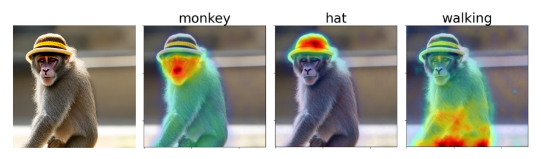
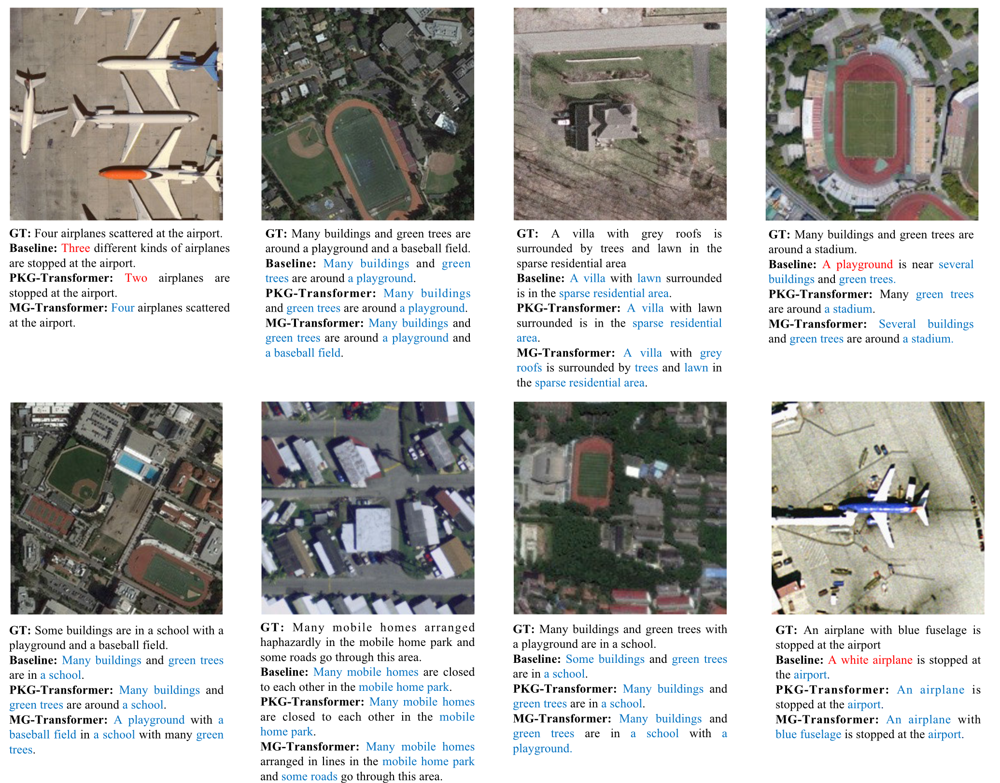
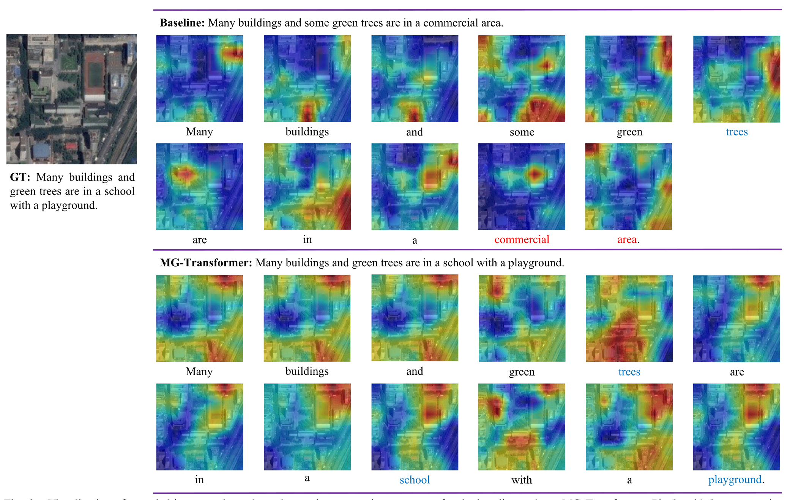
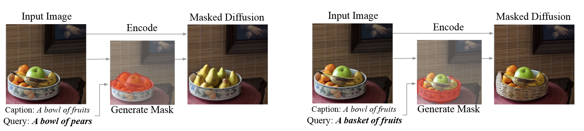
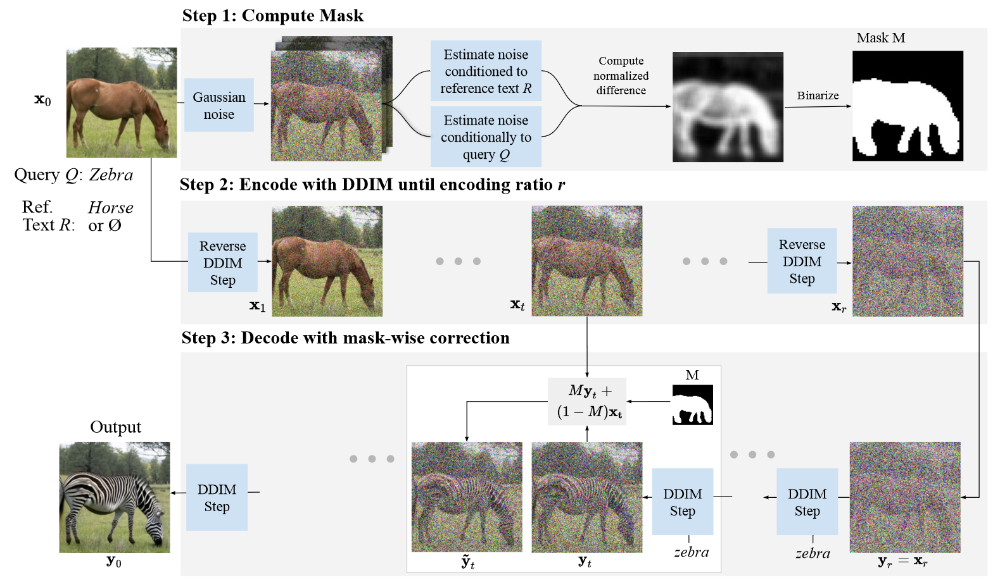
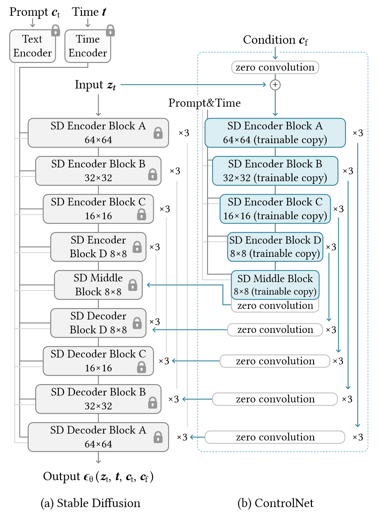

# GISLab_Course

"Introduction to Diffusion Models" - GIS Lab 2024 Short-term Course

See online keynote(.md) [here](./docs/keynote.md).

Keynote(.pptx) download link [here](https://pan.baidu.com/s/1NAZi_NWV3lNLi1rNXhJxhA?pwd=0702).

## Agenda & Discussion Board

### July<sup>3rd</sup>

To-do List:

- [x] GitHub Collaboration & Overleaf Collaboration (optional)
- [x] Understand General Project Purpose and Pipeline (see [here](./docs/pipeline.md))

### July<sup>4th</sup>

Problems and Solutions:

- [x] Cuda Out of Memory (details see [here](./discussion.md#74-syt))
  1. Check whether already use GPU, if true, turn to `step2`.
  2. Compared the total memory of your GPU and the desired memory of the project. If the desired one exceeds the local capability, turn `step3`.
  3. Deploy the project on the GPU clusters from GISLab. First, make sure you are confident with what you are going to do with this project as well as the experiments in mind. Then, I will ask the administrator to register the cluster for me. Finally, regarding the deployment on a cluster server, ask the TA. Liang for details.

To-do List:

- [x] Prepare Presentation on `Project Understanding and Experiment Design` for the next day (July 5th)

### July<sup>5th</sup>

Problems and Solutions:

- [x] Suggestions given by Prof. Zhang

1. Estimate the model performance for current models ✔


To-do List:

- [x] Get to know the heating dataset (e.g. [xBD](https://xview2.org/dataset))

### July<sup>6th</sup>

Problems and Solutions:

- [x] Network Error with Server Cluster

To-do List:

- [x] Read the work of [DiffusionSAT](./readings/DiffusionSAT/Khanna%20et%20al_2023_DiffusionSat.pdf) carefully on `research background`, `pretraining and fine-tuning dataset` ,`model architecture` and `evaluation` （see [notes](./discussion.md#76sakura)）

### July<sup>7th</sup>

Problems and Solutions:

- [x] None

To-do List:

- [x] Prepare Presentation for the next day (July 8th)
  - display samples generate by Stable Diffusion
  - display samples generate by DiffusionSAT
  - compare their difference with same prompt in naive way
  - discuss the future evaluation **metrics**

### July<sup>8th</sup>

Problems and Solutions:

- [x] None

To-do List:

- [x] Further design the pipeline of our experiments (see [here](./docs/pipeline.md/#experiments))
- [x] Set up the environment of  [DiffusionSAT](https://github.com/samar-khanna/DiffusionSat), [Stable Diffusion](https://github.com/CompVis/stable-diffusion) and [ControlNet](https://github.com/lllyasviel/ControlNet) respectively
- [x] Read the paper and code of [DiffusionSAT](https://github.com/samar-khanna/DiffusionSat)
- [x] Think about how to generate batch of prompts with language model assistant.

### July<sup>9th</sup>

Problems and Solutions:

- [x] None

To-do List:

- [x] Read the paper and code of `DiffusionSAT`, see materials [here](./docs/introduction_to_diffusionsat.md) along with [PowerPoint](./lectures/Introduction_to_DiffusionSAT.pptx)
- [x] Set up the environment of  [DiffusionSAT](https://github.com/samar-khanna/DiffusionSat), [Stable Diffusion](https://github.com/CompVis/stable-diffusion) and [ControlNet](https://github.com/lllyasviel/ControlNet) respectively
  
- [x] Think about how to generate batch of prompts with language model assistant.

Notes:

1. xBD has 2 version of publication, be it [CVPR Workshop 2018](https://openaccess.thecvf.com/content_CVPRW_2019/html/cv4gc/Gupta_Creating_xBD_A_Dataset_for_Assessing_Building_Damage_from_Satellite_CVPRW_2019_paper.html) and [arXiv 2019](https://arxiv.org/abs/1911.09296), the arXiv version is correspondent to the released xBD dataset, where CVPR version is out-of-date
2. The evolution of Stable Diffusion refers to note [here](./discussion.md#introduction-to-stable-diffusion-series-model). Stable Diffusion v1,v1.x,v2.1 (2021-2022) have same architecture which is used for ControlNet and  DiffusionSat. Stable Diffusion XL and XL Turbo are released in 2023 with new architecture. Stable Diffusion 3 is released in 2024.6 which is pretrained on 1B images and has a rectified workflow architecture that combined much more encoder modules than before.

### July<sup>10th</sup>-July<sup>13th</sup>

Problems and Solutions:

- [x] None

To-do List:

- [x] Generate batch of prompts with language model assistant - [RSGPT](./projects/RSGPT/README.md).
- [x] Deploy Stable Diffusion 3 on Server which is capable of image-to-image generation
- [x] DiffusionSat is able to use .json file for batch generation (test-version)
- [x] Try [CogVLM2](https://huggingface.co/THUDM/cogvlm2-llama3-chat-19B) for image captioning
- [x] Read documentation of [diffusers](https://hf-mirror.com/docs/diffusers/v0.29.2/en/index) package
- [x] Prepare dataset for training ControlNet in DiffusionSat, follow [ControlNet training example by diffusers](./docs/train_with_diffusers.md) to train diffusionsat that is able to execute in painting task (i.e. generated post-event image with given pre-event image as shown in [paper](./readings/DiffusionSAT/Khanna%20et%20al_2023_DiffusionSat.pdf))

### July<sup>14th</sup>

To-do List:

- [x] Using `diffusers` pipeline unified all projects into `SD-All` including SD v2.1, SD XL Turbo, SD 3 and DiffusionSat

### July<sup>15th</sup>-July<sup>18th</sup>

To-do List:

- [x] Evaluate the performance of all models with MSE, SSIM, LPIPS and PSNR
- [x] Using [CogVLM2](https://huggingface.co/THUDM/cogvlm2-llama3-chat-19B) for image captioning
- [x] Using [T5](https://huggingface.co/google-t5/t5-large) for image captioning summarization

Note:

- [x] Discard [RSGPT](./projects/RSGPT/README.md) for captioning and summarization

### July<sup>19th</sup>-July<sup>20th</sup>

- [x] Midterm Presentation

### July<sup>21st</sup>

#### New Directions

##### Attention Visualization using Diffusers + [DaaM](https://github.com/castorini/daam)

<div align="center"><p>The original synthesized image and three DAAM [1] maps for “monkey,” “hat,” and “walking,” from the prompt, “monkey with hat walking.”</p></div>

DAAM method produces attribution maps of prompt on stable diffusion (the first to interpret large diffusion models from a visuolinguistic perspective).

>  [1] R. Tang et al., ‘What the DAAM: Interpreting Stable Diffusion Using Cross Attention’, presented at the ACL 2023, A. Rogers, J. Boyd-Graber, and N. Okazaki, Eds., Toronto, Canada: Association for Computational Linguistics, Jul. 2023, pp. 5644–5659. doi: 10.18653/v1/2023.acl-long.310.

##### Remote Sensing Image Captioning State-of-the-art Model 

[MG-Transformer](https://github.com/One-paper-luck/MG-Transformer) [2] and [PKG-Transformer](https://github.com/One-paper-luck/PKG-Transformer) [3] are supposed to be more suitable for remote sensing image captioning.

<div align="center"><p>Examples of captions generated by the baseline, PKG-Transformer,[3] and the proposed MG-Transformer [2], as well as the corresponding GT captions. Some detailed and accurate words are marked in blue. And the words that are inconsistent with the image content are marked in red.</p><p>Visualization of attended image regions along the caption generation processes for the baseline and our MG-Transformer. Pixels with larger attention weights are highlighted in red, while those with lower attention weights are highlighted in blue.</p></div>

> [2] L. Meng, J. Wang, R. Meng, Y. Yang, and L. Xiao, ‘A Multiscale Grouping Transformer With CLIP Latents for Remote Sensing Image Captioning’, *IEEE Transactions on Geoscience and Remote Sensing*, vol. 62, pp. 1–15, Apr. 2024, doi: [10.1109/TGRS.2024.3385500](https://doi.org/10.1109/TGRS.2024.3385500).
>
> [3] L. Meng, J. Wang, Y. Yang, and L. Xiao, ‘Prior Knowledge-Guided Transformer for Remote Sensing Image Captioning’, *IEEE Transactions on Geoscience and Remote Sensing*, vol. 61, pp. 1–13, Aug. 2023, doi: [10.1109/TGRS.2023.3328181](https://doi.org/10.1109/TGRS.2023.3328181).

##### Condition Image Generation Technique - DiffEdit (integrated in `diffusers`)

[Huggingface/Diffusers/API/Pipelines/DiffEdit](https://huggingface.co/docs/diffusers/api/pipelines/diffedit)

<div align="center">In semantic image editing the goal is to modify an input image based on a textual query, while otherwise leaving the image as close as possible to the original. In our DIFFEDIT [4] approach, a mask generation module determines which part of the image should be edited, and an encoder infers the latents, to provide inputs to a text-conditional diffusion model which produces the image edit.The three steps of DIFFEDIT. Step 1: we add noise to the input image, and denoise it: once conditioned on the query text, and once conditioned on a reference text (or unconditionally). We derive a mask based on the difference in the denoising results. Step 2: we encode the input image with DDIM, to estimate the latents corresponding to the input image. Step 3: we perform DDIM decoding conditioned on the text query, using the inferred mask to replace the background with pixel values coming from the encoding process at the corresponding timestep.</div>

> [4] G. Couairon, J. Verbeek, H. Schwenk, and M. Cord, ‘DiffEdit: Diffusion-based semantic image editing with mask guidance’, presented at the The Eleventh International Conference on Learning Representations, Sep. 2022. Accessed: Jul. 20, 2024. [Online]. Available: https://openreview.net/forum?id=3lge0p5o-M-

##### [Overcome 77 tokens in Stable Diffusion (diffusers)](https://medium.com/@natsunoyuki/using-long-prompts-with-the-diffusers-package-with-prompt-embeddings-819657943050)

**Solution: Use prompt embedding instead of prompt.**

The first step is to tokenize the prompt and the negative prompt, assuming that the prompt is longer than the negative prompt.

```python
input_ids = pipeline.tokenizer(
    prompt, 
    return_tensors="pt", 
    truncation=False
).input_ids.to("cuda")
```

For example, the long prompt provided by [wnwntk511 on CivitAI](https://civitai.com/images/1321964?modelVersionId=105253&prioritizedUserIds=587535&period=AllTime&sort=Most+Reactions&limit=20) are tokenized to a Tensor with 256 elements (which will be truncated to 77 by CLIP):

```python
>>> input_ids
>>> tensor([[49406,   263,  1125,   268, 16157,   267,  1532,  1125,   267, 12066,
           267,   949,  3027,   267,   279,   330,   267,    84,  4414,   267,
          6323,  1125,   267, 21682,   912,   620,   267,  1994,  9977,   267,
          8157,  4353,   267,  8118, 12609,  3575,   267, 16157,  3575,   267,
          1215, 22984, 28215,   267, 16575,  4605, 12609,   267, 11444,   537,
         29616,  2353,   267,  3077, 27897,   267,  1860,  3073,   267,  3049,
          3073,   267,   664, 23752,  3575,   267, 18105,  2812, 21339,   267,
           949,  6052,   267,   949,  7068,   267, 25602,  5799,   267, 18768,
          6052,   267,  1868,   794,   267, 16179,   281,   272,   269,   275,
          2361,   263,  3878,   268, 15893,  1710,   267,  1878, 35016,  9083,
          1710,   267,  8037,  1215,  2361, 29802,   537,   736,  8847,   267,
           263,  2866,  3095,  2361,  3415,  1400,  1228,  2556,   267,   263,
           330,   268,  2852,  8884,   267,  1526,  5915,   267,  8034,  2488,
          2361,   263,  3005,   937,   706,   267,  1538,  7072,   267, 12364,
         18459,   267,  2699, 30191,   267,  2699, 12995,  6609,  3905, 37637,
           281,   272,   269,   275,  2361,   263,   272,  1611,   267,  5797,
          1611,   281,   272,   269,   274,  2361,   263, 25602,  1093,   539,
           320,  2582,  8405,  3540,  3874,   530,   320,  3694,   539,   320,
          3144,  1704,   267,  3184,  1093,   267,  1769,   537, 12587,   267,
         13106,   930,   281,   272,   269,   274,  2361,   263, 10789,  5135,
         18503,   267,  1476,  1774, 16167,  3940,   593,  3946,  2614,   281,
           272,   269,   274,  2361,   263, 40171,  7355,   267,  6631,   267,
          3254,   320,  8670,   537,  1070,  1538, 11356,   267,  4652,   267,
           820,  5684,   320, 11356,   281,   272,   269,   275,  2361,   263,
          9920,   320,  1205,  4040,   525,   893,   281,   272,   269,   273,
          2361, 42176,   696,  7373,   267, 49407]], device='cuda:0')
```

After tokenizing the prompt and negative prompt, the next step is to encode the tokens into embeddings. The result for the prompt is a Tensor of shape `[1, 256, 768]`.

```python
concat_embeds = []
# max_length=77
for i in range(0, input_ids.shape[-1], max_length):
    concat_embeds.append(
        pipe.text_encoder(
            input_ids[:, i: i + max_length]
        )[0]
    )
prompt_embeds = torch.cat(concat_embeds, dim=1)
>>> prompt_embeds.shape
>>> torch.Size([1, 256, 768])
```

The prompt and negative prompt embeddings can then be fed into the pipeline without being truncated, and the diffusion model will use the full prompt to generate images!

```python
new_img = pipe(
    prompt_embeds = prompt_embeds,
    negative_prompt_embeds = negative_prompt_embeds,
    width = width,
    height = height,
    guidance_scale = guidance_scale,
    num_inference_steps = num_inference_steps,
    num_images_per_prompt = 1,
    generator = torch.manual_seed(seed),
).images
```

> [!IMPORTANT] Comment@Sakura
> I think this solution works well that do little harm to diffusion model itself. Although, in this example, it is applied in the inference step, I suppose it be plausible in the training/fine-tuning step also!. 
>
> The reason why i think this long embedding is acceptable is that text embedding is fed into SD Encoder & Decoder block with cross-attention, so there is no worry how long it is. BUT, as stable diffusion is pretrained on text embedding no more than 77 tokens, we adopt longer prompt embedding in the further-training/fine-tuning step can be somehow less effective. Although, long prompt might distract the attention, where important prompt is not correctly noticed by model.

<div align="center">Stabel Diffusion v2.1 Architecture with ControlNet [5].</div>

> [5] L. Zhang, A. Rao, and M. Agrawala, ‘Adding Conditional Control to Text-to-Image Diffusion Models’, in 2023 IEEE/CVF International Conference on Computer Vision (ICCV), Oct. 2023, pp. 3813–3824. doi: 10.1109/ICCV51070.2023.00355.

##### Data Augmentation in Training

As we notice [Stable Diffusion v2.1](https://huggingface.co/stabilityai/stable-diffusion-2-1) [7] is pretrained on LAION-5B [8] with 512×512 image size, we consider the fine-tuning step image input size as 512×512 is more suitable and consistent. If we are going to use other training size, take a data curriculum where first training on 512×512 then move to 256×256 (which is considered as a generalization -> specification).

Also, as xBD [6] dataset only contains ~11k pre-event&post-event image pairs with 512×512, we consider following data augmentation methods to increase the training dataset.

1. Divide each image into four 256×256 patches (and their horizontal reflections). This increase the size of training set by a factor of 8. This method is first introduced in AlexNet [9] in 2012.
2. ~~Perform PCA on the set of RGB pixel values.~~ This method is also followed by AlexNet [9], but I do not recommend.
3. Reuse the image pairs for training but with different prompt style. The first 11k pairs are using prompt generated by CogVLM2+T5 within 77 tokens. Then the following can be a) long prompt (200-300 tokens, using embedding techniques mentioned above for input) by CogVLM2 b) divided long prompt (200-300 tokens) into 3×normal prompt(<77tokens) c) captions generated by [MG-Transformer](https://github.com/One-paper-luck/MG-Transformer) [2] and [PKG-Transformer](https://github.com/One-paper-luck/PKG-Transformer) [3]

> [6] R. Gupta *et al.*, ‘Creating xBD: A Dataset for Assessing Building Damage from Satellite Imagery’, in *Proceedings of the IEEE/CVF Conference on Computer Vision and Pattern Recognition Workshops*, 2019, pp. 10–17. Accessed: Jun. 24, 2024. [Online]. Available: https://openaccess.thecvf.com/content_CVPRW_2019/html/cv4gc/Gupta_Creating_xBD_A_Dataset_for_Assessing_Building_Damage_from_Satellite_CVPRW_2019_paper.html
>
> [7] R. Rombach, A. Blattmann, D. Lorenz, P. Esser, and B. Ommer, ‘High-Resolution Image Synthesis With Latent Diffusion Models’, presented at the Proceedings of the IEEE/CVF Conference on Computer Vision and Pattern Recognition, 2022, pp. 10684–10695. Accessed: Jun. 29, 2024. [Online]. Available: https://openaccess.thecvf.com/content/CVPR2022/html/Rombach_High-Resolution_Image_Synthesis_With_Latent_Diffusion_Models_CVPR_2022_paper.html
>
> [8] C. Schuhmann *et al.*, ‘LAION-5B: An open large-scale dataset for training next generation image-text models’, in *Advances in Neural Information Processing Systems*, Dec. 2022, pp. 25278–25294. Accessed: Jul. 20, 2024. [Online]. Available: https://proceedings.neurips.cc/paper_files/paper/2022/hash/a1859debfb3b59d094f3504d5ebb6c25-Abstract-Datasets_and_Benchmarks.html
>
> [9] A. Krizhevsky, I. Sutskever, and G. E. Hinton, ‘ImageNet Classification with Deep Convolutional Neural Networks’, in *Neural Information Processing Systems*, Curran Associates, Inc., 2012. Accessed: Apr. 29, 2024. [Online]. Available: https://papers.nips.cc/paper_files/paper/2012/hash/c399862d3b9d6b76c8436e924a68c45b-Abstract.html

### August<sup>19th</sup>

- Add [Keynote](lectures/Temporal_Image-to-Image_Generation.pptx) for Temporal Generation Techniques, see Keynote in [PDF](./lectures/Temporal_Image-to-Image_Generation.pdf)
- Add [Keynote](lectures/Workflow_of_Image_Captioning_for_Disaster_RSIs.pptx) for Image Captioning for RSIs, see Keynote in [PDF](./lectures/Workflow_of_Image_Captioning_for_Disaster_RSIs.pdf)

