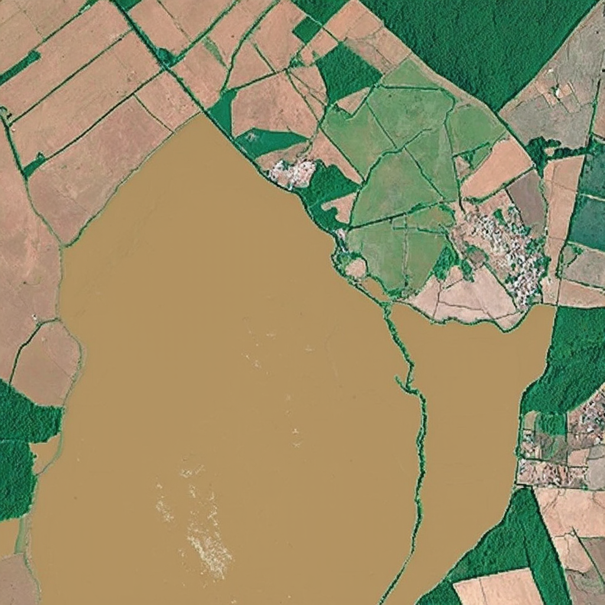
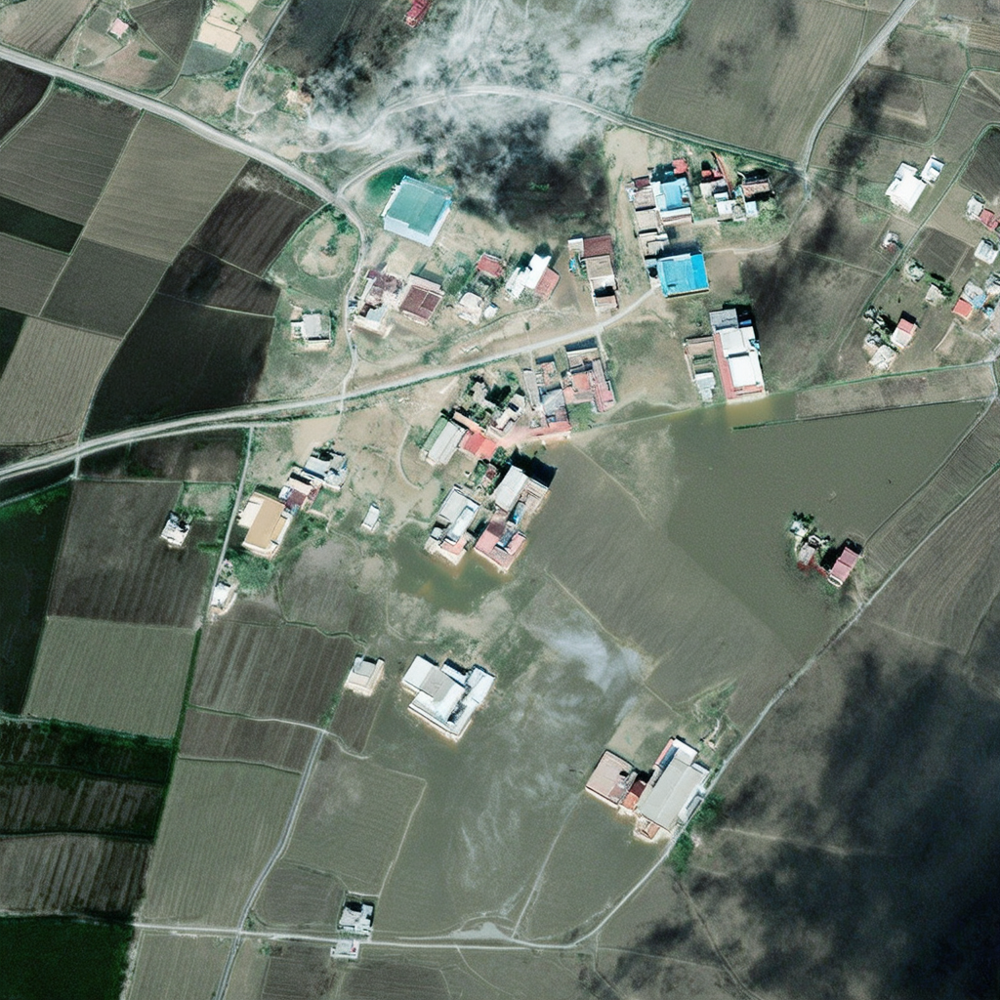

# Discussion

---

## 7/4 syt

1. **工作内容：** 部署stable-diffusion
2. **进展：** 完成依赖环境的部署，目前卡在sample的运行阶段
3. **问题：** 改了N个bug，现在终端报错cuda内存分配不足


---

## 7/5 张丰老师点评pre

1. 大模型目前能力如何，有一个预期
2. 对标注数据要重视

---

## 7/6@sakura

### Formatted Git Commit

1. **feat**: Adding a new feature

   ```
   feat: Add authentication feature
   ```

2. **fix**: Fixing a bug

   ```
   fix: Resolve issue with user login
   ```

3. **docs**: Updating documentation

   ```
   docs: Update README with installation instructions
   ```

4. **style**: Improving code style/formatting

   ```
   style: Format code using PEP8 guidelines
   ```

5. **refactor**: Refactoring code without changing its behavior

   ```
   refactor: Simplify error handling logic
   ```

6. **test**: Adding or modifying tests

   ```
   test: Add unit tests for user authentication
   ```

7. **chore**: Updating tasks, build process, etc.

   ```
   chore: Update dependencies in requirements.txt
   ```

8. **perf**: Improving performance

   ```
   perf: Optimize database query for faster response times
   ```

### Notes for [DiffusionSAT](https://www.samarkhanna.com/DiffusionSat/)

> This note is written by Sakura in assistent with GPT-4o.

#### Research Background 研究背景

> Shortage of Current Models 当下模型的缺陷 (Khanna et al., 2023, p. 1)

Existing diffusion-based image generation models are primarily trained on **natural images**, while satellite images significantly **differ** in terms of perspective, resolution, additional spectral bands, and temporal regularity. Satellite images are often **multi-spectral** and can be irregularly sampled across time, making traditional diffusion models inadequate for tasks such as environmental monitoring and crop-yield prediction, which require the handling of **spatio-temporal** data. Furthermore, the inherent spatio-temporal nature of remote sensing data necessitates conditional generation tasks not supported by traditional methods based on **captions or images** .

现有的以扩散模型为基础的图像生成模型主要基于**自然图像**进行训练，而遥感图像在视角、分辨率、附加光谱带和时间规律性等方面与自然图像有**显著差异**。遥感图像通常是多光谱的，并且可能在**时间上不规则采样**，这使得传统的扩散模型无法胜任诸如环境监测和作物产量预测等需要处理**时空**数据的任务。此外，遥感数据固有的时空特性使得传统的基于**文本概要和参考图像**的生成方法不适合遥感图像的生成 。

> Main Contributions 主要贡献 (Khanna et al., 2023, p. 2)

1. **Generative Foundation Model for Satellite Imagery**
   - We propose a novel generative foundation model for satellite image data with the ability to generate high-resolution satellite imagery from **numerical metadata** as well as text.

2. **3D Conditioning Extension**
   - We design a novel **3D-conditioning extension** which enables DiffusionSat to demonstrate state-of-the-art performance on super-resolution, temporal generation, and in-painting.

3. **Large-Scale Training Dataset**
   - We collect and compile a global generative pre-training dataset from large, publicly available satellite image datasets.

   **针对卫星图像的生成基础模型**

   - 本文提出了一种新的生成基础模型，该模型能够从**数值元数据**和文本生成高分辨率的卫星图像 。

   **3D 条件扩展**

   - 本文设计了一种新的 **3D 条件扩展**，使 DiffusionSat 在超分辨率、时序生成和修复等任务中表现出最先进的性能。

   **大规模训练数据集**

   - 本文从大量公开的卫星图像数据集中收集和编制了一个全球尺度用于生成式预训练的遥感图像数据集。

#### Dataset 预处理和微调数据集

DiffusionSat was trained on a collection of publicly available, high-resolution remote sensing datasets, such as fMoW, Satlas, and SpaceNet. The metadata used includes **longitude, latitude, ground sampling distance, and cloud cover.** To generate a caption, the **semantic class and country code** are considered. For example, in the fMoW dataset, images are categorized into one of 62 classes with associated metadata. Satlas includes NAIP and Sentinel-2 images, and SpaceNet offers datasets for tasks like object detection and segmentation.

DiffusionSat 模型在一系列公开的高分辨率遥感数据集上进行训练，这些数据集包括 fMoW、Satlas 和 SpaceNet。使用的元数据包括**经度、纬度、地面采样距离和云层覆盖率**。为了生成标题，考虑了**语义类别和国家代码**。例如，在 fMoW 数据集中，图像被分类为 62 个类别之一，并附有相关元数据。Satlas 包括 NAIP 和 Sentinel-2 图像，SpaceNet 提供用于目标检测和分割等任务的数据集。


Figure. Sample captions and pre-normalization metadata for the fMoW, Satlas, and SpaceNet datasets (Khanna et al., 2023, p. 17).

#### Model Architecture 模型架构

> [!WARNING]
>
>ChatGPT认为零卷积模块的维度是1x1或者1x1x1，但我并不这么认为，阅读代码确认这个事情。

DiffusionSat consists of two main components: the Stable Diffusion backbone and the adapted 3D ControlNet.

1. **Stable Diffusion Backbone**

   - Architecture

     : The Stable Diffusion backbone leverages Latent Diffusion Models (LDMs) to efficiently generate high-resolution images. LDMs operate in a compressed latent space, which is significantly lower in dimensionality than the original pixel space. This approach involves two key steps:

     1. **Autoencoder**: The model first uses a variational autoencoder (VAE) to encode high-resolution satellite images into a latent space. The encoder compresses the input image into a lower-dimensional latent representation, while the decoder reconstructs the image from this representation. This step ensures that the most relevant semantic information is retained while reducing computational complexity.
     2. **Diffusion Process**: The actual generative process is applied in the latent space. A series of denoising autoencoders, implemented as a UNet architecture, gradually refine the latent representation by reversing the process of adding noise. This diffusion process allows for high-quality image synthesis with reduced computational and memory requirements.

2. **Adapted 3D ControlNet**

   - **Architecture**: The adapted 3D ControlNet is designed to handle the spatio-temporal complexities of satellite imagery. It incorporates metadata such as geolocation and timestamps into the generative process. The 3D ControlNet architecture extends traditional 2D convolutional layers to 3D, allowing the model to process sequences of images and their associated metadata over time.
   - **Functionality**: ControlNet adds spatial conditioning controls to large, pretrained diffusion models like Stable Diffusion. This is achieved by locking the parameters of the large model and making a trainable copy of its encoding layers. The trainable copy integrates additional conditions through "zero convolutions" (1x1 convolutions initialized to zero), which ensure no harmful noise affects the fine-tuning process. The dimensions of these zero convolution layers match the input and output feature maps, typically maintaining the same height, width, and number of channels as the original network blocks. The conditioning information, such as edges, depth, segmentation, and human pose, is encoded into a feature space that matches the latent space of Stable Diffusion, guiding the generative process to produce accurate and contextually relevant satellite images.

DiffusionSat 由两个主要部分组成：Stable Diffusion 主干和适配的 3D ControlNet。

1. **Stable Diffusion 主干**

   - 架构

     : Stable Diffusion 主干利用潜在扩散模型 (LDM) 高效生成高分辨率图像。LDM 在压缩的潜在空间中操作，该空间的维度显著低于原始像素空间。这种方法包括两个关键步骤：

     1. **自动编码器**: 该模型首先使用变分自编码器 (VAE) 将高分辨率卫星图像编码到潜在空间中。编码器将输入图像压缩为低维潜在表示，而解码器则从该表示中重建图像。此步骤确保保留最相关的语义信息，同时降低计算复杂性。
     2. **扩散过程**: 实际生成过程在潜在空间中进行。通过一系列去噪自动编码器（实现为 UNet 架构），逐步优化潜在表示，逆转加噪过程。这个扩散过程允许在降低计算和内存需求的同时实现高质量的图像生成。

2. **适配的 3D ControlNet**

   - **架构**: 适配的 3D ControlNet 旨在处理卫星图像的时空复杂性。它将地理位置和时间戳等元数据融入生成过程。3D ControlNet 架构将传统的 2D 卷积层扩展到 3D，使模型能够处理图像序列及其随时间变化的相关元数据。
   - **功能**: ControlNet 为大型预训练扩散模型（如 Stable Diffusion）添加空间条件控制。通过锁定大模型的参数并复制其编码层来实现这一点。可训练的副本通过“零卷积”（初始化为零的 1x1 卷积）集成附加条件，确保微调过程中没有有害噪声影响。这些零卷积层的尺寸与输入和输出特征图相匹配，通常保持与原始网络块相同的高度、宽度和通道数。边缘、深度、分割和人体姿态等条件信息被编码到与 Stable Diffusion 潜在空间匹配的特征空间中，引导生成过程，生成准确且上下文相关的卫星图像。


Figure. Architecture of DiffusionSAT (Khanna et al., 2023, p. 4).

#### Evaluation 评估

DiffusionSat's performance was evaluated using a variety of metrics and tasks to demonstrate its effectiveness in generating high-quality satellite imagery and handling spatio-temporal data. The evaluation focuses on several key areas:

1. **Metrics Used**:
   - **Fréchet Inception Distance (FID)**: Measures the distance between the distributions of generated images and real images, assessing the quality and diversity of the generated images.
   - **Inception Score (IS)**: Evaluates the quality of generated images based on the confidence of a pre-trained classifier.
   - **Structural Similarity Index Measure (SSIM)**: Assesses the similarity between generated and real images in terms of structure and visual quality.
   - **Peak Signal-to-Noise Ratio (PSNR)**: Measures the reconstruction quality of generated images.
   - **Learned Perceptual Image Patch Similarity (LPIPS)**: Evaluates perceptual similarity between generated and real images based on deep network features.
2. **Single Image Generation**:
   - DiffusionSat is pre-trained to generate high-resolution satellite images from metadata and text captions. The model's ability to produce visually appealing and contextually accurate images was evaluated using FID, IS, and LPIPS metrics, showing significant improvements over existing state-of-the-art methods.
3. **Conditional Generation Tasks**:
   - **Super-Resolution**: The model's capability to enhance the resolution of low-quality satellite images was tested. Results demonstrated that DiffusionSat could generate high-resolution images with fine-grained details, outperforming other methods.
   - **Temporal Generation**: The ability to predict and generate future satellite images based on historical data was assessed. DiffusionSat's performance in temporal generation tasks was evaluated using SSIM and PSNR metrics, indicating superior accuracy and temporal consistency.
   - **In-Painting**: The model's effectiveness in filling in missing parts of satellite images was also tested. DiffusionSat showed impressive results in generating plausible and contextually relevant image completions.
4. **Qualitative Results**:
   - Visual inspections of generated images revealed that DiffusionSat produces high-quality satellite images with realistic details and minimal artifacts. The model's ability to handle various conditions, such as different weather patterns and times of the day, was also highlighted.

DiffusionSat 的性能通过多种指标和任务进行了评估，以展示其生成高质量卫星图像和处理时空数据的有效性。评估主要集中在几个关键领域：

1. **使用的指标**：
   - **Fréchet Inception Distance (FID)**：衡量生成图像和真实图像分布之间的距离，评估生成图像的质量和多样性。
   - **Inception Score (IS)**：基于预训练分类器的置信度评估生成图像的质量。
   - **结构相似性指数 (SSIM)**：从结构和视觉质量方面评估生成图像和真实图像之间的相似性。
   - **峰值信噪比 (PSNR)**：衡量生成图像的重建质量。
   - **学习感知图像块相似性 (LPIPS)**：基于深度网络特征评估生成图像和真实图像之间的感知相似性。
2. **单张图像生成**：
   - DiffusionSat 预训练生成高分辨率的卫星图像，基于元数据和文本字幕。使用 FID、IS 和 LPIPS 指标评估模型生成视觉上令人满意且在上下文中准确的图像，显示出相对于现有最先进方法的显著改进。
3. **条件生成任务**：
   - **超分辨率**：测试模型增强低质量卫星图像分辨率的能力。结果表明，DiffusionSat 能够生成具有细节的高分辨率图像，优于其他方法。
   - **时间生成**：评估基于历史数据预测和生成未来卫星图像的能力。使用 SSIM 和 PSNR 指标评估 DiffusionSat 在时间生成任务中的表现，表明其在准确性和时间一致性方面具有优越性。
   - **修复**：测试模型填补卫星图像中缺失部分的有效性。DiffusionSat 在生成合理且在上下文中相关的图像补全方面表现出色。
4. **定性结果**：
   - 生成图像的视觉检查表明，DiffusionSat 生成的卫星图像具有真实的细节和最少的伪影。模型在处理各种条件（如不同的天气模式和一天中的不同时间）方面的能力也得到了强调。


> FID指标见论文 Heusel, M., Ramsauer, H., Unterthiner, T., Nessler, B., & Hochreiter, S. (2017). GANs Trained by a Two Time-Scale Update Rule Converge to a Local Nash Equilibrium. *Advances in Neural Information Processing Systems*, *30*. <https://proceedings.neurips.cc/paper/2017/hash/8a1d694707eb0fefe65871369074926d-Abstract.html>

#### References 参考文献

Khanna, S., Liu, P., Zhou, L., Meng, C., Rombach, R., Burke, M., Lobell, D. B., & Ermon, S. (2023). *DiffusionSat: A Generative Foundation Model for Satellite Imagery*. Published as a conference paper at ICLR 2024.

Heusel, M., Ramsauer, H., Unterthiner, T., Nessler, B., & Hochreiter, S. (2017). GANs Trained by a Two Time-Scale Update Rule Converge to a Local Nash Equilibrium. *Advances in Neural Information Processing Systems*, *30*. <https://proceedings.neurips.cc/paper/2017/hash/8a1d694707eb0fefe65871369074926d-Abstract.html>

---

## 7/7@sakura

> [!CAUTION]
> ChatGPT can make mistakes.

### Notes for FID

> Heusel, M., Ramsauer, H., Unterthiner, T., Nessler, B., & Hochreiter, S. (2017). GANs Trained by a Two Time-Scale Update Rule Converge to a Local Nash Equilibrium. *Advances in Neural Information Processing Systems*, *30*. <https://proceedings.neurips.cc/paper/2017/hash/8a1d694707eb0fefe65871369074926d-Abstract.html>

> [!NOTE]
> This note is in assistant with gpt-4o by Sakura.

Fréchet Inception Distance（FID）是一个用于评估生成图像质量的新指标。与之前的Inception Score相比，FID更能够捕捉生成图像与真实图像之间的相似性。

以下是FID的主要特点和用途：

1. **指标原理**：
   - FID通过比较生成图像与真实图像在某个预训练的Inception网络编码层中的分布来评估图像质量。
   - 它假设这些编码层的输出是多维高斯分布，然后计算生成图像和真实图像之间的Fréchet距离（也称Wasserstein-2距离）。

2. **计算方法**：
   - 通过Inception网络的编码层提取生成图像和真实图像的特征。
   - 计算这些特征的均值和协方差矩阵。
   - FID通过这些均值和协方差矩阵计算两组特征之间的Fréchet距离。

3. **用途**：
   - FID用于评估生成的图像质量，量化生成图像与真实图像在视觉特征上的相似性。
   - 一个较低的FID值表示生成的图像与真实图像更为相似，质量更高。
   - FID在图像生成的各种实验中广泛应用，包括人脸图像生成、自然图像生成等。

通过这种方式，FID能够提供一个更加一致和可靠的评估标准，比单纯依赖Inception Score更能反映图像生成模型的性能。


#### FID代码实现

常用的FID计算工具是`pytorch-fid`，它适用于PyTorch用户。你可以通过以下步骤安装和使用：

1. **安装依赖包**：

```bash
pip install pytorch-fid
```

2. **计算FID**：

```python
from pytorch_fid import fid_score

# 生成图像和真实图像所在的文件夹路径
path_to_real_images = 'path/to/real_images'
path_to_generated_images = 'path/to/generated_images'

# 计算FID
fid = fid_score.calculate_fid_given_paths([path_to_real_images, path_to_generated_images], batch_size=50, device='cuda', dims=2048)

print('FID:', fid)
```

### SSIM代码实现

> Genereted by gpt-4o.

SSIM是一种衡量图像相似度的指标，可以直接使用`scikit-image`库中的`ssim`函数，也可以使用自定义的PyTorch实现。这里展示的是自定义的PyTorch实现。

1. **安装依赖库**：

```bash
pip install torch torchvision scikit-image
```

2. **计算SSIM的代码**：

```python
import torch
import torch.nn.functional as F
from torch.autograd import Variable
import numpy as np

def gaussian(window_size, sigma):
    gauss = torch.Tensor([np.exp(-(x - window_size//2)**2/float(2*sigma**2)) for x in range(window_size)])
    return gauss/gauss.sum()

def create_window(window_size, channel):
    _1D_window = gaussian(window_size, 1.5).unsqueeze(1)
    _2D_window = _1D_window.mm(_1D_window.t()).float().unsqueeze(0).unsqueeze(0)
    window = Variable(_2D_window.expand(channel, 1, window_size, window_size).contiguous())
    return window

def ssim(img1, img2, window_size=11, val_range=255):
    L = val_range  # L is the dynamic range of the pixel values (255 for 8-bit grayscale images)

    padd = 0
    (_, channel, _, _) = img1.size()
    window = create_window(window_size, channel)

    mu1 = F.conv2d(img1, window, padding=padd, groups=channel)
    mu2 = F.conv2d(img2, window, padding=padd, groups=channel)

    mu1_sq = mu1.pow(2)
    mu2_sq = mu2.pow(2)
    mu1_mu2 = mu1 * mu2

    sigma1_sq = F.conv2d(img1 * img1, window, padding=padd, groups=channel) - mu1_sq
    sigma2_sq = F.conv2d(img2 * img2, window, padding=padd, groups=channel) - mu2_sq
    sigma12 = F.conv2d(img1 * img2, window, padding=padd, groups=channel) - mu1_mu2

    C1 = (0.01 * L) ** 2
    C2 = (0.03 * L) ** 2

    ssim_map = ((2 * mu1_mu2 + C1) * (2 * sigma12 + C2)) / ((mu1_sq + mu2_sq + C1) * (sigma1_sq + sigma2_sq + C2))
    return ssim_map.mean()

# Example usage
img1 = torch.rand(1, 1, 256, 256) * 255
img2 = torch.rand(1, 1, 256, 256) * 255

print('SSIM:', ssim(img1, img2).item())
```

当然，下面是使用PyTorch计算PSNR（峰值信噪比）的完整代码。

### PSNR代码实现

PSNR是一种用于衡量图像质量的指标，通常用于评估压缩图像与原始图像之间的差异。它的计算方法基于图像的均方误差（MSE）。

1. **安装依赖库**：

```bash
pip install torch torchvision
```

2. **计算PSNR的代码**：

```python
import torch

def psnr(img1, img2):
    """
    Compute the Peak Signal-to-Noise Ratio (PSNR) between two images.
    Args:
        img1, img2: PyTorch tensors of shape (1, 1, H, W) with pixel values in range [0, 255].
    Returns:
        PSNR value in dB.
    """
    mse = torch.mean((img1 - img2) ** 2)
    if mse == 0:
        return float('inf')
    max_pixel = 255.0
    psnr_value = 20 * torch.log10(max_pixel / torch.sqrt(mse))
    return psnr_value

# Example usage
img1 = torch.rand(1, 1, 256, 256) * 255  # Example tensor for image 1
img2 = torch.rand(1, 1, 256, 256) * 255  # Example tensor for image 2

print('PSNR:', psnr(img1, img2).item())
```

> #### 代码解释
>
> 1. **psnr函数**：
>    - 该函数接收两个PyTorch张量`img1`和`img2`，它们的形状为(1, 1, H, W)，表示单通道（灰度）图像，像素值范围为[0, 255]。
>    - 计算图像之间的均方误差（MSE）。
>    - 通过MSE计算PSNR值，公式为：$$ \text{PSNR} = 20 \cdot \log_{10}\left(\frac{\text{MAX}_{\text{pixel}}}{\sqrt{\text{MSE}}}\right) $$，其中MAX_pixel通常为255。
>
> 2. **Example usage**：
>    - 生成两个随机的示例图像张量`img1`和`img2`。
>    - 计算并打印这两个图像的PSNR值。
>

### Note for CLIP

> Radford, A., Kim, J. W., Hallacy, C., Ramesh, A., Goh, G., Agarwal, S., Sastry, G., Askell, A., Mishkin, P., Clark, J., Krueger, G., & Sutskever, I. (2021). Learning Transferable Visual Models From Natural Language Supervision. *Proceedings of the 38th International Conference on Machine Learning*, 8748–8763. <https://proceedings.mlr.press/v139/radford21a.html>

> [!NOTE]
>
> This note is generated in assistant with gpt-4o by Sakura.

CLIP（Contrastive Language-Image Pre-training）模型是一种基于对比学习的多模态模型，旨在通过自然语言监督学习图像表示。CLIP模型包括一个图像编码器和一个文本编码器，分别使用ResNet或Vision Transformer（ViT）架构和12层的Transformer架构。预训练数据集由4亿对图像和文本对组成，称为WebImageText（WIT），这些数据对从互联网上收集。模型通过一个对比学习目标进行训练，以最大化正确图像-文本对的余弦相似度，同时最小化错误对的相似度。CLIP能够零样本迁移到多个下游任务，包括图像分类、OCR、地理定位和动作识别，在这些任务上，CLIP展示了与完全监督基线模型相当甚至更优的性能。其具体应用包括通过自然语言描述来生成图像分类器，提供灵活且无需任务特定训练数据的解决方案。


CLIP-Score是一种通过OpenAI的CLIP模型计算图像和文本匹配度的指标。它通过分别编码图像和文本为特征向量，然后计算它们之间的余弦相似度来评估图像与文本描述之间的相关性。高CLIP-Score表示图像与文本描述高度匹配，常用于图像描述生成、图像检索等领域，帮助评估生成模型或检索系统的性能。

CLIP-Score代码实现

下面是用Python和PyTorch实现计算CLIP-Score的代码。

首先，你需要安装必要的库。如果你还没有安装，可以使用以下命令来安装：

```bash
pip install torch torchvision clip-by-openai
```

以下是一个示例代码，用于计算图像和文本对的CLIP-Score：

```python
import torch
import clip
from PIL import Image

# 加载CLIP模型和预训练的权重
device = "cuda" if torch.cuda.is_available() else "cpu"
model, preprocess = clip.load("ViT-B/32", device=device)

def compute_clip_score(image_path, text):
    # 加载图像并预处理
    image = preprocess(Image.open(image_path)).unsqueeze(0).to(device)
    
    # 编码图像和文本
    with torch.no_grad():
        image_features = model.encode_image(image)
        text_features = model.encode_text(clip.tokenize([text]).to(device))
    
    # 计算余弦相似度
    image_features /= image_features.norm(dim=-1, keepdim=True)
    text_features /= text_features.norm(dim=-1, keepdim=True)
    similarity = (image_features @ text_features.T).item()
    
    return similarity

# 示例使用
image_path = "path/to/your/image.jpg"
text_description = "A description of the image"
clip_score = compute_clip_score(image_path, text_description)
print(f"CLIP-Score: {clip_score}")
```

> ### 代码解释
>
> 1. **加载CLIP模型和预处理器**：
>
>    > ```python
>    > model, preprocess = clip.load("ViT-B/32", device=device)
>    > ```
>    >
>
>    这行代码加载了预训练的CLIP模型（Vision Transformer架构）和图像预处理器。
>
> 2. **预处理图像**：
>
>    ```python
>    image = preprocess(Image.open(image_path)).unsqueeze(0).to(device)
>    ```
>
>    这段代码打开并预处理输入图像，将其转换为适合模型输入的格式。
>
> 3. **编码图像和文本**：
>
>    ```python
>    with torch.no_grad():
>        image_features = model.encode_image(image)
>        text_features = model.encode_text(clip.tokenize([text]).to(device))
>    ```
>
>    使用模型分别编码图像和文本，得到它们的特征向量。
>
> 4. **计算余弦相似度**：
>
>    ```python
>    image_features /= image_features.norm(dim=-1, keepdim=True)
>    text_features /= text_features.norm(dim=-1, keepdim=True)
>    similarity = (image_features @ text_features.T).item()
>    ```
>
>    将特征向量归一化后，计算它们之间的余弦相似度。这个相似度就是CLIP-Score。
>

## 7/8@Sakura

### Introduction to Stable Diffusion Series Model

Progress: Stable Diffusion v1-v1.5 -> Stable Diffusion v2 -> Stable Diffusion XL -> Stable Diffusion XL Turbo -> Stable Diffusion 3

#### Stable Diffusion v1-v1.5

> Rombach, R., Blattmann, A., Lorenz, D., Esser, P., & Ommer, B. (2022). High-Resolution Image Synthesis With Latent Diffusion Models. 10684–10695. <https://openaccess.thecvf.com/content/CVPR2022/html/Rombach_High-Resolution_Image_Synthesis_With_Latent_Diffusion_Models_CVPR_2022_paper.html>

[Paper](./readings/Stable_Diffusion/Rombach%20et%20al_2022_High-Resolution%20Image%20Synthesis%20With%20Latent%20Diffusion%20Models.pdf)

[Code](https://github.com/CompVis/stable-diffusion)

#### Stable Diffusion v2

> Blog only

[Code](https://github.com/Stability-AI/stablediffusion)

#### Stable Diffusion XL

> Podell, D., English, Z., Lacey, K., Blattmann, A., Dockhorn, T., Müller, J., Penna, J., & Rombach, R. (2023, October 13). SDXL: Improving Latent Diffusion Models for High-Resolution Image Synthesis. The Twelfth International Conference on Learning Representations. <https://openreview.net/forum?id=di52zR8xgf>

[Paper](./readings/Stable_Diffusion_XL/Podell%20et%20al.%20-%202023%20-%20SDXL%20Improving%20Latent%20Diffusion%20Models%20for%20High-R.pdf)

[Code](https://github.com/Stability-AI/generative-models)

#### Stable Diffusion XL Turbo

> Sauer, A., Lorenz, D., Blattmann, A., & Rombach, R. (n.d.). Adversarial Diffusion Distillation.

[Technical Report](./readings/Stbale_Diffusion_XL_Turbo/Sauer%20et%20al.%20-%20Adversarial%20Diffusion%20Distillation.pdf)

[Code](https://github.com/Stability-AI/generative-models)

#### Stable Diffusion 3

> Esser, P., Kulal, S., Blattmann, A., Entezari, R., Müller, J., Saini, H., Levi, Y., Lorenz, D., Sauer, A., Boesel, F., Podell, D., Dockhorn, T., English, Z., & Rombach, R. (2024, June 6). Scaling Rectified Flow Transformers for High-Resolution Image Synthesis. Forty-first International Conference on Machine Learning. <https://openreview.net/forum?id=FPnUhsQJ5B>

[Paper](./readings/Stable_Diffusion_3/Esser%20et%20al_2024_Scaling%20Rectified%20Flow%20Transformers%20for%20High-Resolution%20Image%20Synthesis.pdf)

## 7/8 cst展示

### Demo1

```
caption = "a fmow satellite image of a amusement park in Australia"
metadata = [ 925.8798,  345.2111, 411.4541,    0.0000,  308.3333,  166.6667, 354.8387]
```

<div style="display: flex;">
    
    
</div>


### Demo2

```
caption = "a fmow satellite image of a electric substation in India"
metadata = metadata_normalize([76.5712666476, 28.6965307997, 0.929417550564, 0.0765712666476, 2015, 2, 27]).tolist()
```

<div style="display: flex;">
    
    
</div>

### Demo3

```
caption = "A satellite image of a dam in the Three Gorges region, China"
metadata = metadata_normalize([111.0280, 30.8210, 0.975, 0.075, 2023, 8, 15]).tolist()
```

<div style="display: flex;">
    
    
</div>

### Demo4

```
caption = "An urban satellite image highlighting green spaces in Central Park, New York City"
metadata = metadata_normalize([-73.968285, 40.785091, 0.920, 0.080, 2022, 5, 10]).tolist()
```

<div style="display: flex;">
    
    
</div>

## 7/13 prompt变量对比测试

### 受灾程度

```
(1) Prompt: A satellite image of farmland suffering from severe flooding in India
    Output: output_India_1
(2) Prompt: A satellite image of farmland suffering from normal flooding in India
    Output: output_India_2
(3) Prompt: A satellite image of farmland suffering from slight flooding in India
    Output: output_India_3
```

> sequence: DiffusionSat/SDv3/SDv3-reference img

<div style="display: grid; grid-template-columns: repeat(3, 1fr); gap: 10px; text-align: center;">
  <!-- 第一列 -->
  <div>
    
    
    
    <p>severe</p>
  </div>
  <!-- 第二列 -->
  <div>
    
    
    
    <p>normal</p>
  </div>
  <!-- 第三列 -->
  <div>
    
    
    
    <p>slight</p>
  </div>
</div>

总结：DiffusionSat能在一定程度上理解severe等代表灾害程度的形容词，但SD没有这种能力。

### 受灾方位

```
(1) Prompt: A satellite image of Indian farmland suffering from floods, with the affected area located in the northern part of the image
    Output: output_India_4
(2) Prompt: A satellite image of Indian farmland suffering from floods, with the affected area located in the southern part of the image
    Output: output_India_5
(3) Prompt: A satellite image of Indian farmland suffering from floods, with the affected area located in the eastern part of the image
    Output: output_India_6
(4) Prompt: A satellite image of Indian farmland suffering from floods, with the affected area located in the western part of the image
    Output: output_India_7
```
> sequence: DiffusionSat/SDv3-reference img

<div style="display: grid; grid-template-columns: repeat(4, 1fr); gap: 10px; text-align: center;">
  <!-- 第一列 -->
  <div>
    
    
    <p>northern</p>
  </div>
  <!-- 第二列 -->
  <div>
    
    
    <p>southern</p>
  </div>
  <!-- 第三列 -->
  <div>
    
    
    <p>eastern</p>
  </div>
    <!-- 第四列 -->
  <div>
    
    
    <p>western</p>
  </div>
</div>

```
or, describe in another way(upper/lower/left/right side)
Output：output_India_8 to 11
```

<div style="display: grid; grid-template-columns: repeat(4, 1fr); gap: 10px; text-align: center;">
  <!-- 第一列 -->
  <div>
    
    <p>upper</p>
  </div>
  <!-- 第二列 -->
  <div>
    
    <p>lower</p>
  </div>
  <!-- 第三列 -->
  <div>
    
    <p>left</p>
  </div>
    <!-- 第四列 -->
  <div>
    
    <p>right</p>
  </div>
</div>

总结：无论是DiffusionSat或是SD，模型都没有能理解空间关系的能力。

### 地物细节

```
(1) Prompt: A satellite image of Indian farmland suffering from floods, with a building in the image
    Output: output_India_12
(2) Prompt: A satellite image of Indian farmland suffering from floods, with many buildings center on one area of the image
    Output: output_India_13
(3) Prompt: A satellite image of Indian farmland suffering from floods, with many buildings scattering in different areas of the image
    Output: output_India_14
(4) Prompt: A satellite image of Indian farmland suffering from floods, with only two buildings in the image
    Output: output_India_19
```

> sequence: DiffusionSat/SDv3-reference img

<div style="display: grid; grid-template-columns: repeat(4, 1fr); gap: 10px; text-align: center;">
  <!-- 第一列 -->
  <div>
    
    
    <p>one building</p>
  </div>
  <!-- 第二列 -->
  <div>
    
    
    <p>center</p>
  </div>
  <!-- 第三列 -->
  <div>
    
    
    <p>scatter</p>
  </div>
  <!-- 第四列 -->
  <div>
    
    
    <p>two buildings</p>
  </div>
</div>

### 影像质量

```
(1) Prompt: A satellite image of Indian farmland suffering from floods, with no cloud covering the image
    Output: output_India_15
(2) Prompt: A satellite image of Indian farmland suffering from floods, with thick cloud covering the image
    Output: output_India_16
(3) Prompt: A satellite image of Indian farmland suffering from floods, on a large scale
    Output: output_India_17
(4) Prompt: A satellite image of Indian farmland suffering from floods, on a small scale
    Output: output_India_18
```

> sequence: DiffusionSat/SDv3-reference img

<div style="display: grid; grid-template-columns: repeat(4, 1fr); gap: 10px; text-align: center;">
  <!-- 第一列 -->
  <div>
    
    
    <p>no cloud</p>
  </div>
  <!-- 第二列 -->
  <div>
    
    
    <p>thick cloud</p>
  </div>
  <!-- 第三列 -->
  <div>
    
    
    <p>large scale</p>
  </div>
    <!-- 第四列 -->
  <div>
    
    
    <p>small scale</p>
  </div>
</div>
## 7.4Training@sakura

Example: Training ControlNet with Diffusers: [Web Link](https://github.com/huggingface/diffusers/tree/main/examples/controlnet) / [Local Doc](./docs/train_with_diffusers.md)

