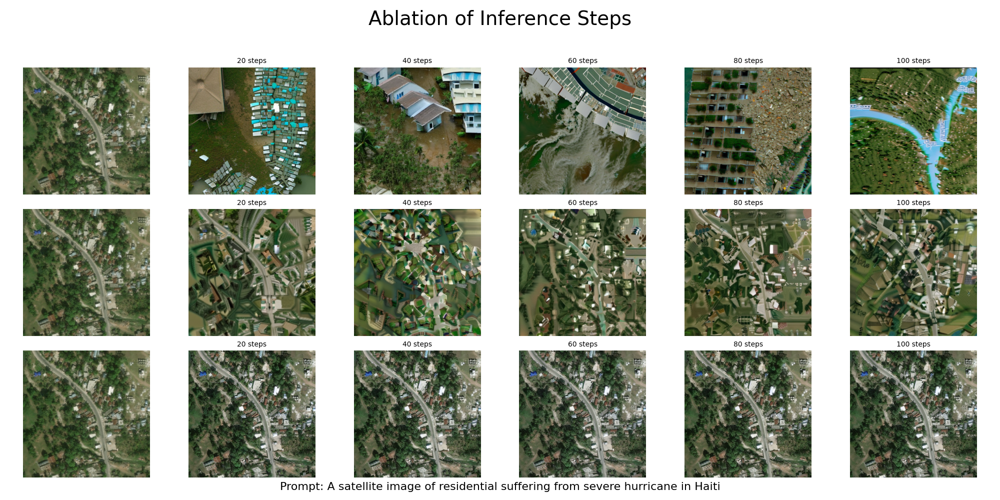

# Experiments

> - Base Model
>
>   - SD2: [stabilityai/stable-diffusion-2-1 · Hugging Face](https://huggingface.co/stabilityai/stable-diffusion-2-1)
>     - fp32
>     - Text-to-image only (base)
>
>   - SDXL:[stabilityai/stable-diffusion-xl-base-1.0 · Hugging Face](https://huggingface.co/stabilityai/stable-diffusion-xl-base-1.0)
>     - fp32
>
>   - SD3: [stabilityai/stable-diffusion-3-medium-diffusers · Hugging Face](https://huggingface.co/stabilityai/stable-diffusion-3-medium-diffusers)
>     - fp16
>
> - Fine-tuned Model on SD2
>
>   - DiffusionSat: [github.com/samar-khanna/DiffusionSat](https://github.com/samar-khanna/DiffusionSat)
>     - fp32
>     - Text-to-image only (base)
>   - InstructPix2Pix: [timbrooks/instruct-pix2pix · Hugging Face](https://huggingface.co/timbrooks/instruct-pix2pix)
>     - fp32
>     - Image-to-image only (base)
>
>

## Main Experiments

## Ablation Experiment

### Stable Diffusion Configuration

#### Inference Steps (text-to-image)

#### Inference Steps (image-to-image)

#### Guidance Sacle

#### Image Size
