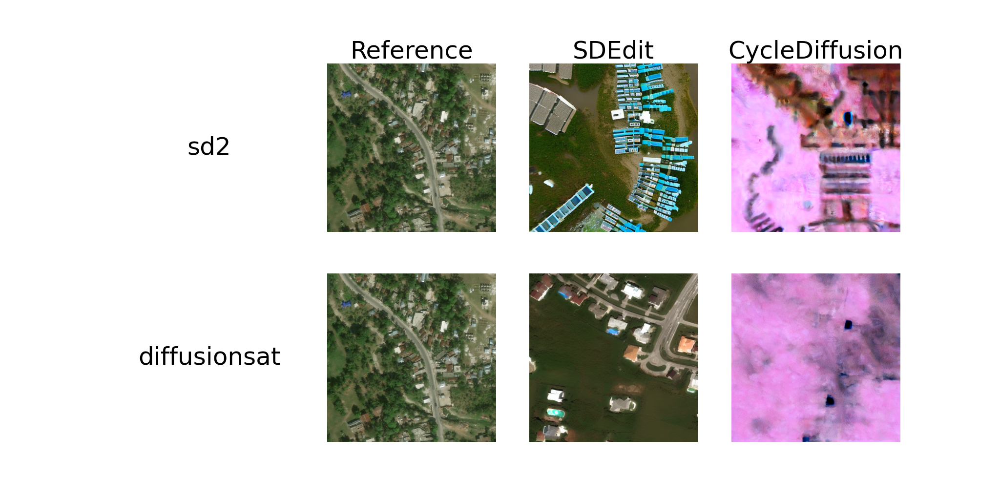

# Experiments

Base Model

- SD2: [stabilityai/stable-diffusion-2-1 · Hugging Face](https://huggingface.co/stabilityai/stable-diffusion-2-1)
  - fp32
  - Text-to-image ✔
  - Image-to-image （SDEdit [1] Cycle Diffusion [4]）✔
  
- SDXL:[stabilityai/stable-diffusion-xl-base-1.0 · Hugging Face](https://huggingface.co/stabilityai/stable-diffusion-xl-base-1.0)
  - fp32
  - Text-to-image ✔
  - Image-to-image （SDEdit [1] Cycle Diffusion [4]）✔
  
- SD3: [stabilityai/stable-diffusion-3-medium-diffusers · Hugging Face](https://huggingface.co/stabilityai/stable-diffusion-3-medium-diffusers)
  - fp16
  - Text-to-image ✔
  - Image-to-image （SDEdit [1] Cycle Diffusion [4]）✔

Fine-tuned Model on SD2

- DiffusionSat: [github.com/samar-khanna/DiffusionSat](https://github.com/samar-khanna/DiffusionSat)
  - fp32

  - Text-to-image ✔

  - Image-to-image （SDEdit [1] Cycle Diffusion [4]）✔

    > we adopt SDEdit [1] and Cycle Diffusion for official checkpoint with conditioning diffusionsat is not released

- InstructPix2Pix: [timbrooks/instruct-pix2pix · Hugging Face](https://huggingface.co/timbrooks/instruct-pix2pix)
  - fp32
  - Text-to-image ❌
  - Image-to-image （InstructPix2Pix [2]）✔

- BLIP-Diffusion: [salesforce/blipdiffusion · Hugging Face](https://huggingface.co/salesforce/blipdiffusion)

  - ...

> [1] C. Meng *et al.*, ‘SDEdit: Guided Image Synthesis and Editing with Stochastic Differential Equations’, presented at the International Conference on Learning Representations, Oct. 2021. Accessed: Jul. 23, 2024. [Online]. Available: <https://openreview.net/forum?id=aBsCjcPu_tE>
>
> [2] T. Brooks, A. Holynski, and A. A. Efros, ‘InstructPix2Pix: Learning To Follow Image Editing Instructions’, presented at the Proceedings of the IEEE/CVF Conference on Computer Vision and Pattern Recognition, 2023, pp. 18392–18402. Accessed: Jul. 21, 2024. [Online]. Available: <https://openaccess.thecvf.com/content/CVPR2023/html/Brooks_InstructPix2Pix_Learning_To_Follow_Image_Editing_Instructions_CVPR_2023_paper.html>
>
> [3] D. Podell *et al.*, ‘SDXL: Improving Latent Diffusion Models for High-Resolution Image Synthesis’, presented at the The Twelfth International Conference on Learning Representations, Oct. 2023. Accessed: Jul. 07, 2024. [Online]. Available: <https://openreview.net/forum?id=di52zR8xgf>
>
> [4] C. H. Wu and F. De la Torre, ‘A Latent Space of Stochastic Diffusion Models for Zero-Shot Image Editing and Guidance’, presented at the Proceedings of the IEEE/CVF International Conference on Computer Vision, 2023, pp. 7378–7387. Accessed: Jul. 24, 2024. [Online]. Available: <https://openaccess.thecvf.com/content/ICCV2023/html/Wu_A_Latent_Space_of_Stochastic_Diffusion_Models_for_Zero-Shot_Image_ICCV_2023_paper.html>
>
> [5] D. Li, J. Li, and S. Hoi, ‘BLIP-Diffusion: Pre-trained Subject Representation for Controllable Text-to-Image Generation and Editing’, in *Advances in Neural Information Processing Systems*, Dec. 2023, pp. 30146–30166. Accessed: Jul. 24, 2024. [Online]. Available: <https://proceedings.neurips.cc/paper_files/paper/2023/hash/602e1a5de9c47df34cae39353a7f5bb1-Abstract-Conference.html>

## Main Experiments

###

| Models                            | FID  | CLIP-Score | SSIM | PSNR |
| --------------------------------- | ---- | ---------- | ---- | ---- |
| **Base Model**                    | /    | /          | /    | /    |
| Stable Diffusion* (SDEdit)        |      |            |      |      |
| Stable Diffusion (CycleDiffusion) |      |            |      |      |
| Stable Diffusion XL Turbo         |      |            |      |      |
| Stable Diffusion 3                |      |            |      |      |
| **Fine-tuned Model on SD2**       | /    | /          | /    | /    |
| DiffusionSat* (SDEdit)            |      |            |      |      |
| DiffusionSat* (CycleDiffusion)    |      |            |      |      |
| **Our Model**                     |      |            |      |      |

Table. Comparison of Post-event Image-to-Image Generation with <a href="https://github.com/CompVis/stable-diffusion">Stable Diffusion</a> based models.

> Stable Diffusion denotes `stabilityai/stable-diffusion-2-1` (fine-tuned on 768×768). DiffusionSat denotes single generation model with 512×512.

## Ablation Experiment

### Stable Diffusion Configuration

#### Image-to-image techniques

#### Inference Steps (text-to-image)

#### Inference Steps (image-to-image)

#### Guidance Sacle (text-to-image)

#### Guidance Sacle (image-to-image)

#### Image Size
