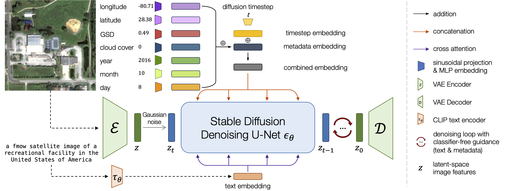
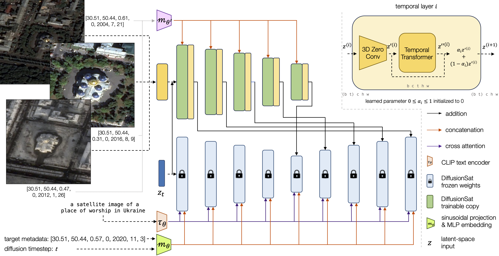

# Introducation to DiffusionSat

> Project Link: [DiffusionSat (samarkhanna.com)](https://www.samarkhanna.com/DiffusionSat/)

## Outline

- Overview

- Model Architecture 

  - SD

  - SD + ControlNet

- Single Image Generation
  - Textual Prompt + Numerical Metadata

- Inverse Problems

  - Superresolution


  - Temporal Prediction


  - Temporal Inpainting


  - Temporal Sequence Generation


- Implementation in Python Project

## Overview

ABSTRACT: Diffusion models have achieved state-of-the-art results on many modalities including images, speech, and video. However, existing models are not tailored to support remote sensing data, which is widely used in important applications including environmental monitoring and crop-yield prediction. Satellite images are significantly different from natural images -- they can be multi-spectral, irregularly sampled across time -- and existing diffusion models trained on images from the Web do not support them. Furthermore, remote sensing data is inherently spatio-temporal, requiring conditional generation tasks not supported by traditional methods based on captions or images. In this paper, we present DiffusionSat, to date the largest generative foundation model trained on a collection of publicly available large, high-resolution remote sensing datasets. As text-based captions are sparsely available for satellite images, we incorporate the associated metadata such as geolocation as conditioning information. Our method produces realistic samples and can be used to solve multiple generative tasks including temporal generation, superresolution given multi-spectral inputs and in-painting. Our method outperforms previous state-of-the-art methods for satellite image generation and is the first large-scale *generative* foundation model for satellite imagery.

扩散模型在图像、语音和视频等多种模态上取得了最先进的成果。然而，现有模型并不支持在重要应用如环境监测和作物产量预测中广泛使用的遥感数据。卫星图像与自然图像显著不同——它们可以是多光谱的、时间上不规则采样的。现有的扩散模型无法处理这些数据。遥感数据本质上是时空数据，需要传统基于字幕或图像的方法不支持的条件生成任务。本文提出了DiffusionSat，这是迄今为止基于公共大规模高分辨率遥感数据集训练的最大生成基础模型。由于卫星图像的文字描述稀少，我们结合了地理位置等相关元数据作为条件信息。我们的方法生成逼真的样本，可用于解决多种生成任务，包括时间生成、多光谱输入的超分辨率和修复。我们的方法在卫星图像生成方面优于现有最先进的方法，是第一个大规模的卫星图像生成基础模型。

## Model Architecture 

### Stable Diffusion (Naive Image Generation)



<div align="center">Conditioning on freely available metadata and using large, publicly available satellite imagery datasets shows DiffusionSat is a powerful generative foundation model for remote sensing data.</div>

### Stable Diffuison + ControlNet (Conditioning Image Generation)

In addition to single image generation, we demonstrate DiffusionSat's ability to solve a range of inverse problems, such as superresolution, temporal prediction/interpolation, and in-painting. Broadly, solving these problems requires conditioning on a *control signal*, which can be another image, spectral bands, or a sequence of images.

To tackle this class of problems, we modify a ContolNet architecture to accept sequences of image input. Each item in the sequence is associated with its own metadata. This architecture then enables DiffusionSat to condition on an input control signal (eg: a low-resolution image) and then generate a new image corresponding to target metadata (eg: a superresolved high-resolution image).

除了单图像生成外，我们展示了DiffusionSat解决超分辨率、时间预测/插值和修复等逆问题的能力。解决这些问题大体上需要对控制信号进行条件设置，控制信号可以是另一张图像、多光谱图像或图像序列。

为了解决这类问题，我们修改了ControlNet架构，使其接受图像输入序列。序列中的每个项目都有其元数据。该架构使DiffusionSat能够在输入控制信号（例如低分辨率图像）上进行条件设置，然后生成与目标元数据对应的新图像（例如高分辨率图像）。



<div align="center">A 3D ContolNet that can flexibly condition on sequences of inputs with associated metadata.</div>

## Single Image Generation

>  Textual Prompt + Numerical Metadata

First, we discuss how DiffusionSat generates standalone (single) images. We initialize a denoising UNet with StableDiffusion 2.1 weights and pretrain the model on a collection of large, publicly available satellite datasets such as [fMoW](https://github.com/fMoW), [SpaceNet](https://spacenet.ai/datasets/) and [Satlas](https://github.com/allenai/satlas). We generate rough captions from available class and bounding box information. Simply using these captions isn't enough-- we find that the key to good satellite image generation is to condition on *numerical metadata* in the same way as the diffusion timestep (with a sinusoidal projection and MLP embedding). Doing so leads to more controllable generation, seen below.

首先，我们讨论了DiffusionSat如何生成单个图像。我们用StableDiffusion 2.1权重初始化一个去噪UNet，并在大量公开卫星数据集（如fMoW、SpaceNet和Satlas）上对模型进行预训练。我们从可用的类别和边界框信息生成粗略的描述。仅使用这些描述还不够——我们发现，生成高质量卫星图像的关键在于像扩散时间步一样对数值元数据进行条件设置（通过正弦投影和MLP嵌入）。这样做可以实现更可控的生成，如下所示。


<div align="center">Here we generate samples from single-image DiffusionSat. We see that changing the coordinates from a location in Paris to one in USA changes the type of stadium generated, with American football and baseball more likely to appear in the latter location. Additionally, for locations that receive snow, DiffusionSat accurately captures the correlation between location and season. However, naively incorporating the metadata into the text caption results in poorer conditioning flexibility across geography and season, (eg: with winter and summer time images produced for both August and January, or a lack of “zooming in” when lowering the GSD).</div>

## Conditional Image Generation

#### Superresolution 超分

Arguably, the most widely recognized generative inverse problem for remote sensing data is superresolution. We show that given a multi-spectral, low-resolution (10m-60m GSD) Sentinel-2 image, DiffusionSat can reconstruct the corresponding high-resolution (~0.3m GSD) fMoW image. This is an especially challenging task, since the input must be upsampled >20x. We train the super-resolution model using a dataset of paired ([fMoW-Sentinel](https://sustainlab-group.github.io/SatMAE/), [fMoW-RGB](https://github.com/fMoW)) images.

遥感数据生成逆问题中最广为人知的可能是超分辨率。我们展示了在给定多光谱、低分辨率（10m-60m GSD）的Sentinel-2图像时，DiffusionSat可以重建相应的高分辨率（约0.3m GSD）的fMoW图像。这是一项特别具有挑战性的任务，因为输入必须上采样超过20倍。我们使用成对（fMoW-Sentinel、fMoW-RGB）图像的数据集训练超分辨率模型。


<div align="center">Results on the superresolution task, comparing DiffusionSat with other baselines.</div>

SWIR, NIR, and RGB refer to the different multispectral bands of Sentinel-2 images. HR corresponds to the ground-truth high-resolution image. SD refers to vanilla StableDiffusion. DiffusionSat does well to reconstruct realistic high-resolution images compared to other baselines. However, like other diffusion models, it can sometimes hallucinate small details in the images to preserve realism over an exact reconstruction.

在超分辨率任务上的结果，比较了DiffusionSat与其他基线模型。SWIR、NIR和RGB指的是Sentinel-2图像的不同多光谱波段。HR对应于地面实况高分辨率图像。SD指的是原始StableDiffusion。与其他基线模型相比，DiffusionSat在重建逼真的高分辨率图像方面表现出色。然而，像其他扩散模型一样，它有时会在图像中产生幻觉，以保持逼真性而不是精确重建。

<div align="center">Table: Single-image 512x512 generation on the validation set of fMoW. † refers to finetuned SD 2.1 without any metadata information. ‡ refers to incorporating the metadata in the text caption.</div>

| Method | FID↓ | IS↑  | CLIP↑ |
| ------ | ---- | ---- | ----- |
| SD 2.1 | 117.74 | 6.42 | 17.23 |
| SD 2.1† | 37.99 | 7.42 | 16.59 |
| SD 2.1 ‡ | 24.23 | **7.60** | **18.62** |
| Ours     | **15.80** | 6.69 | 17.20 |


<div align="center">Table: Image sample quality quantitative results on fMoW superresolution. DBPN refers to Haris et al. (2018), Pix2Pix is from Isola et al. (2017). Our method beats other super-resolution models for multi-spectral data.</div> 

| **Method** | **SSIM↑**  | **PSNR↑**   | **LPIPS↓** | **MSE↓**   |
| ---------- | ---------- | ----------- | ---------- | ---------- |
| Pix2Pix    | 0.1374     | 8.2722      | 0.6895     | 0.1492     |
| DBPN       | 0.1518     | **11.8568** | 0.6826     | **0.0680** |
| SD         | 0.1671     | 10.2417     | 0.6403     | 0.0962     |
| SD + CN    | 0.1626     | 10.0098     | 0.6506     | 0.1009     |
| **Ours**   | **0.1703** | 10.3924     | **0.6221** | 0.0928     |

#### Temporal Prediction 时序预测

With DiffusionSat's ability to condition on input sequences, we can tackle inverse problems such as temporal prediction and interpolation. Given a sequence of input satellite images of a location distributed across time (not necessarily in order), along with their corresponding metadata, we can prompt DiffusionSat to reconstruct an image in the past, in the future, or anywhere in the middle of the temporal sequence. We use the [fMoW-RGB](https://github.com/fMoW) dataset and construct temporal sequences of images of the same location. DiffusionSat is then trained to reconstruct a randomly chosen target image given the other images (in any order) of the sequence.

通过DiffusionSat对输入序列进行条件设置的能力，我们可以解决时间预测和插值等逆问题。给定某一地点的分布在时间上的输入卫星图像序列（不一定按顺序），以及其对应的元数据，我们可以提示DiffusionSat重建过去、未来或时间序列中任何位置的图像。我们使用fMoW-RGB数据集并构建同一地点的时间序列图像。然后，训练DiffusionSat在给定序列中其他图像（任何顺序）时重建随机选择的目标图像。


<div align="center">Results on the temporal prediction task. DiffusionSat can predict images in the past or future.</div>

The ground truth images are in the center, marked by their years and months. The column of images with the date marked under the blue date represent the target image in the past to reconstruct, given the other three images (to the right) as input. The reconstructions from different models are shown to the left. Similarly, the column of images marked under the red date are the target future images to reconstruct given the three images to the left as input. DiffusionSat is able to predict images in the past and future effectively, once again proving capable to tackle challenging inverse problems.

在时间预测任务上的结果。DiffusionSat可以预测过去或未来的图像。中心的是地面实况图像，标有年份和月份。蓝色日期下标记的图像列表示目标过去图像的重建，输入的是右边的三张图像。同样，红色日期下标记的图像列表示目标未来图像的重建，输入的是左边的三张图像。DiffusionSat能够有效预测过去和未来的图像，再次证明其解决具有挑战性的逆问题的能力。

<div align="center">Table: Sample quality quantitative results on fMoW-temporal validation data. t′ > t represents generating an image in the past given a future image, and t′ < t is the task for generating a future image given a past image.</div>

| Model                        | t′ > t     |             |            | t′ < t     |             |            |
| ---------------------------- | ---------- | ----------- | ---------- | ---------- | ----------- | ---------- |
|                              | SSIM↑      | PSNR↑       | LPIPS↓     | SSIM↑      | PSNR↑       | LPIPS↓     |
| STSR (EAD) (He et al., 2021) | 0.3657     | 13.5191     | 0.4898     | 0.3654     | 13.7425     | 0.4940     |
| MCVD (Voleti et al., 2022)   | 0.3110     | 9.6330      | 0.6058     | 0.2721     | 9.5559      | 0.6124     |
| SD + 3D CN                   | 0.2027     | 11.0536     | 0.5523     | 0.2218     | 11.3094     | 0.5342     |
| DiffusionSat + CN            | 0.3297     | 13.6938     | 0.5062     | 0.2862     | 12.4990     | 0.5307     |
| DiffusionSat + 3D CN         | **0.3983** | **13.7886** | **0.4304** | **0.4293** | **14.8699** | **0.3937** |

#### Temporal Inpainting 时序修复

Inpainting is another inverse problem where the goal is to reconstruct portions of the image which have been corrupted. Rather than artificially corrupt input images, we choose the [xBD dataset](https://www.v7labs.com/open-datasets/xbd-dataset) which contains before and after images of locations afflicted by different natural disasters. The goal is to reconstruct the before-disaster image given the post-disaster image, or vice versa. In-painting consists of reconstructing damaged roads, houses, and landscapes given the post-disaster image, or adding damage to regular images.

修复是另一种逆问题，目标是重建已损坏的图像部分。我们选择xBD数据集，该数据集包含了受不同自然灾害影响的地点的灾前和灾后图像。目标是给定灾后图像重建灾前图像，反之亦然。修复包括在给定灾后图像的情况下重建损坏的道路、房屋和景观，或在正常图像中添加损坏。


<div>Results on the inpainting task. DiffusionSat can reconstruct or visualize damaged areas effectively.</div>

The caption on the left of each row of 4 images is the disaster type. The "pred-past" column represents DiffusionSat's reconstruction given the after-disaster image (marked by the date in red) as input. Similarly for the "pred-future" column, given the before-disaster image as input. DiffusionSat effectively reconstructs houses and roads which have been partially or almost completely damaged in floods, fires and other disasters. It can even reconstruct parts of the image masked by cloud cover. We hope this can play a role in assisting teams to respond effectively to natural disasters.

在修复任务上的结果。DiffusionSat能够有效地重建或可视化受损区域。每行4张图像左侧的标题是灾害类型。pred-past列表示给定灾后图像（红色日期标记）输入时的DiffusionSat重建。同样，pred-future列表示给定灾前图像输入时的重建。DiffusionSat有效重建了洪水、火灾等灾害中部分或几乎完全损坏的房屋和道路。它甚至可以重建被云层遮盖的图像部分。我们希望这可以在自然灾害应急响应中发挥作用。

#### Temporal Sequence Generation 时序图像生成

We can combine the single-image and conditional DiffusionSat architectures to auto-regressively generate full sequences of satellite images! We do this by generating the "seed" image from single image DiffusionSat (given an input text prompt and metadata), and then using conditional DiffusionSat to predict the next image for some desired metadata. Then, both images form the control signal input for the next generation, and so on.

我们可以结合单图像和条件DiffusionSat架构，自回归生成完整的卫星图像序列！我们通过从单图像DiffusionSat生成“种子”图像（给定输入文本提示和元数据），然后使用条件DiffusionSat预测一些目标元数据的下一个图像来实现。然后，两个图像形成下一个生成的控制信号输入，依此类推。


<div align="center">DiffusionSat can generate full sequences of satellite images!</div>

## Limitation 不足和展望

Like other diffusion models, DiffusionSat can occasionally hallucinate details, and its results can vary significantly for a given prompt or control signal. Users should be mindful of these limitations when assessing the outputs of models like DiffusionSat. Further research on controlling the reliability of diffusion model outputs will be crucial to make accurate geospatial predictions for inverse problems such as super-resolution and temporal prediction. More research on producing large-scale caption-annotated satellite image datasets will also be very helpful!

像其他扩散模型一样，DiffusionSat有时会产生幻觉细节，其结果可能因给定的提示或控制信号而有显著差异。在评估DiffusionSat等模型的输出时，用户应注意这些限制。关于控制扩散模型输出可靠性的进一步研究将对于进行逆问题（如超分辨率和时间预测）的准确地理空间预测至关重要。关于生成大规模带字幕的卫星图像数据集的更多研究也将非常有帮助。

## References

```
@inproceedings{
    khanna2024diffusionsat,
    title={DiffusionSat: A Generative Foundation Model for Satellite Imagery},
    author={Samar Khanna and Patrick Liu and Linqi Zhou and Chenlin Meng and Robin Rombach and Marshall Burke and David B. Lobell and Stefano Ermon},
    booktitle={The Twelfth International Conference on Learning Representations},
    year={2024},
    url={https://openreview.net/forum?id=I5webNFDgQ}
}
```