# Introduction to Diffusion Models —— GIS Lab 2024 Short-term Course

> [!NOTE]
> Keynote for "Introduction to Diffusion Models —— GIS Lab 2024 Short-term Course" is available on BaiduNetdisk [here](https://pan.baidu.com/s/1NAZi_NWV3lNLi1rNXhJxhA?pwd=0702).

> Presentor: Sakura (Chen Zhenyuan) M.Eng.
>
> Department: School of Earth Science, Zhejiang University
>
> Date: July 2, 2024
>
> Contact me: [bili_sakura@zju.edu.cn](mailto:bili_sakura@zju.edu.cn)

## Copyright Statement

© Sakura, 2024. All rights reserved. This document is protected by copyright law. No part of this publication may be reproduced, distributed, or transmitted in any form or by any means, including photocopying, recording, or other electronic or mechanical methods, without the prior written permission of the author, except in the case of brief quotations embodied in critical reviews and certain other noncommercial uses permitted by copyright law. For permission requests, please contact the author at [bili_sakura@zju.edu.cn](mailto:bili_sakura@zju.edu.cn).

## Outline

- [Background](#background)

  - Prosperity of Generative Artificial Intelligence (Gen AI)

  - Progress of Deep Generative Models
- [Introduction](#introduction)
  - Generation from Scratch
  - Auto-regression
  - Generalized Auto-regression
  - Denoising Diffusion
- [Techniques of Diffusion Models](#techniques-of-diffusion-models)
  - Evolution of Architectures
  - Conditional Generation
  - Robustness
- [**Practice on Diffusion Model**](#practice-on-diffusion-model)
  - Diffusion Model in Remote Sensing (RS)
  - Research Background
  - Experiments

## Background

### Prosperity of Gen AI: Midjourney

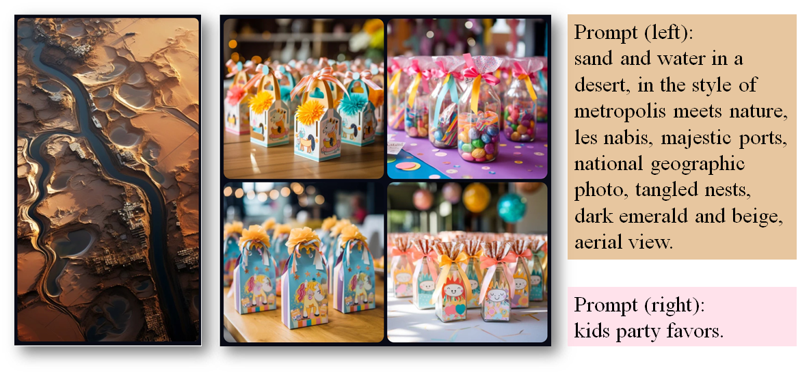
Awesome pictures generated by Midjourney V5.*

> <https://legacy.midjourney.com/showcase/>

### Prosperity of Gen AI: DALL·E 3

DALL·E 3 is capable of understanding complex instructions.*

> <https://openai.com/blog/dall-e-3-is-now-available-in-chatgpt-plus-and-enterprise>

### Prosperity of Gen AI: Gen-2

Text to Video by Gen-2. *

 (The late afternoon sun peeking through the window of a New York City loft.)

> <https://research.runwayml.com/gen2>

### Prosperity of Gen AI: Pika

Text to Video. *

(cinematic, aerial drone flythough over seashore of the vast mountain cliffs of Scotland, strong breeze blowing hair and strong ocean waves, dolly in)

> <https://pika.art/>

### Progress of Deep Generative Models

    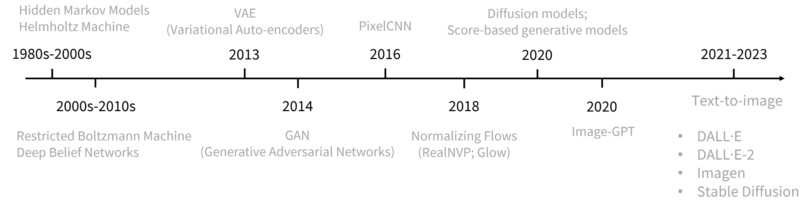
    
Progress of deep generative models <a href="https://thudzj.github.io/">[1]</a>.

## Introduction

### Generation from Scratch

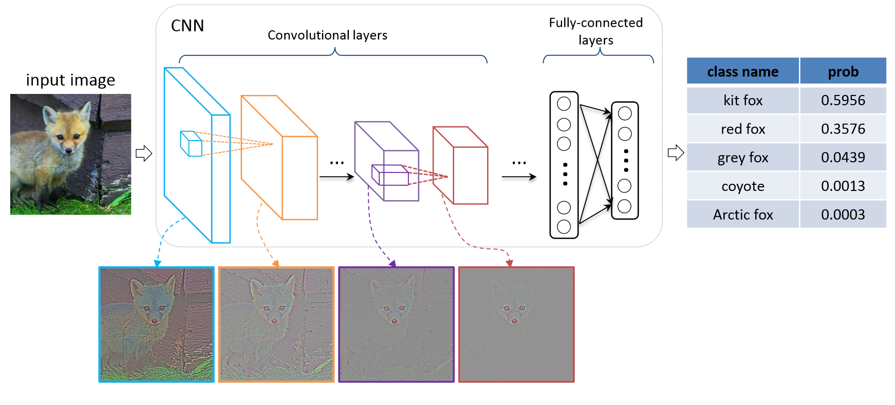

Above: Architecture of VGG <a href="https://www.semanticscholar.org/paper/Very-Deep-Convolutional-Networks-for-Large-Scale-Simonyan-Zisserman/eb42cf88027de515750f230b23b1a057dc782108">[2]</a>. Bottom: The illustration of external and internal behavior of a CNN <a href="https://www.semanticscholar.org/paper/Visualizing-and-Comparing-AlexNet-and-VGG-using-Yu-Yang/dae981902b1f6d869ef2d047612b90cdbe43fd1e">[3]</a>. (VGG team won ILSVRC 2014 <a href="http://arxiv.org/abs/1409.0575">[4]</a> with 1st in localization Task and 2nd in classification task.

    
    

  
Why Naïve Generation Doesn't Work. *

    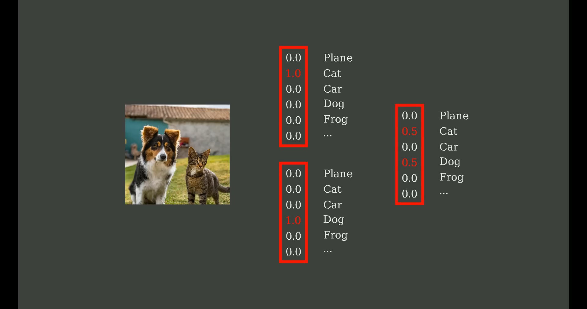
    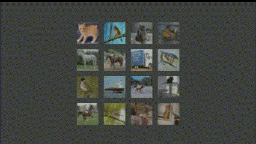

Left: Average makes sense in label prediction.*

Right: Average does not make sense in pixel level prediction.*

### Auto-regression

    
    

Left: A neural network (purple) predicts the last pixel.*

Right: A neural network (pink) predicts the second last pixel.*

    

We succeed in generating an image from nothing by predicting the next pixel.*

    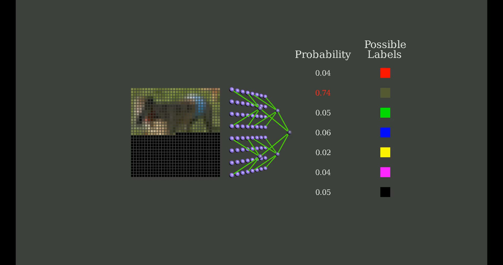
    

Left: A determined neural network give the identical result
given the same first pixel value. *

Right: We can randomly sample pixel value in each step to generate different images from identical initial pixel. *

    

 Auto regressor for image generation. *

    

Auto regressor for text generation. *

> <https://www.youtube.com/watch?v=zc5NTeJbk-k>

### Generalized Auto-regression

Predict a whole block instead of single pixel.*

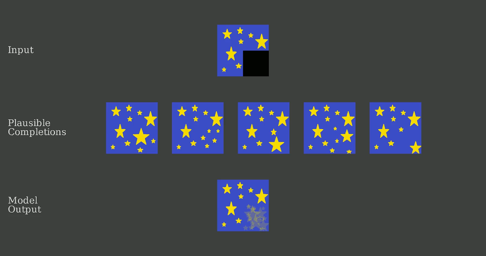

Average in pixel value leads to non-sense.*

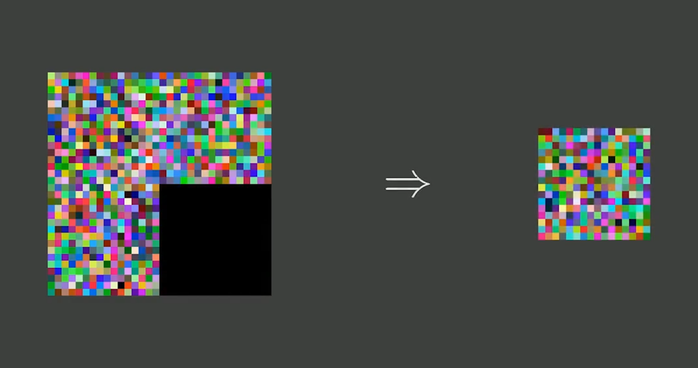

We can feel free to predict any pixel seperately, if pixel value is statistically independent.*

    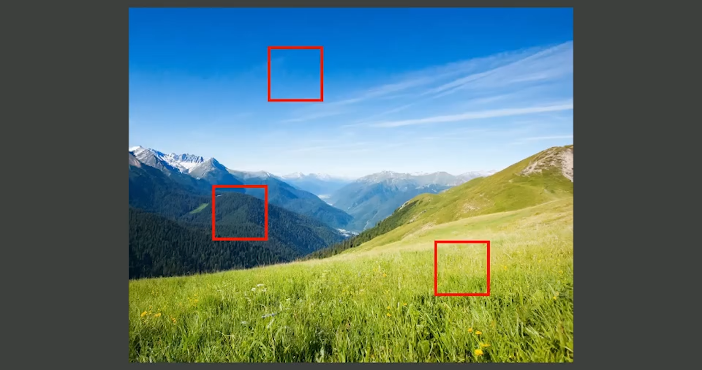
    
It is noted that near pixels are the most strongly related, because they are usaually part of the same object.*

    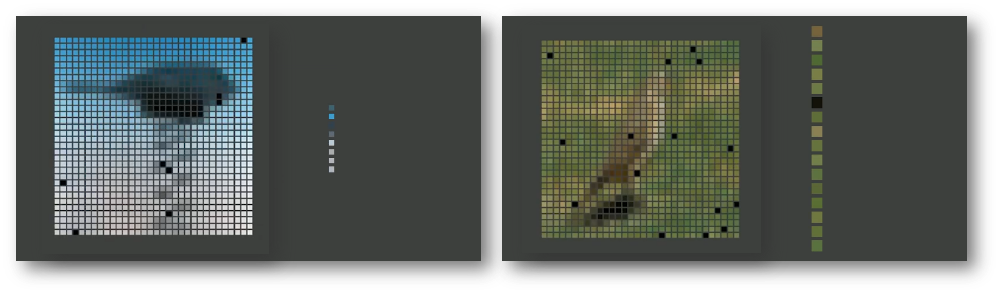
    
Remove separate pixels from the image and train a network to predict them (as these pixels are far from each other, we regard them as independent).*

    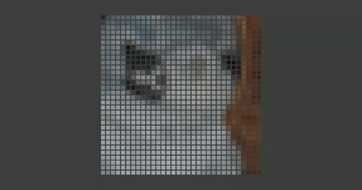

 Remove indepedent pixels graudually (the reversed process is to predict the image).*

    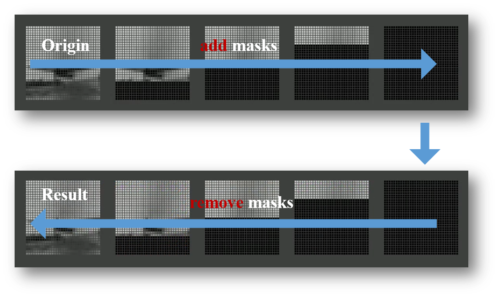

 Auto regressor generate images in two steps (add masks & remove masks).*

    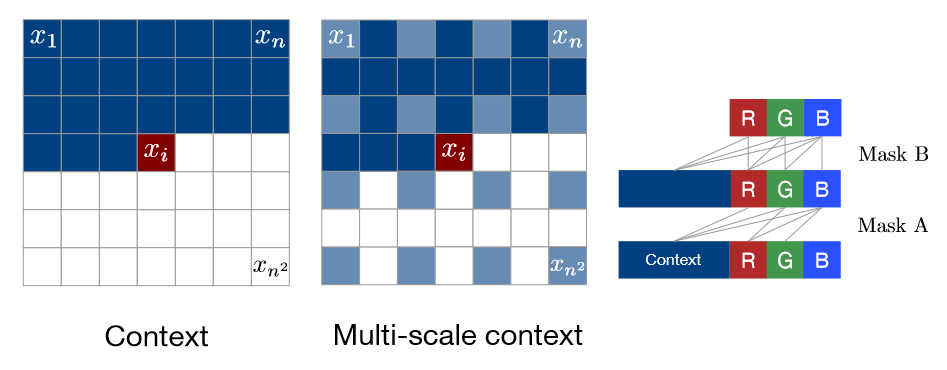

 Illustration of PixelCNN <a href="https://proceedings.mlr.press/v48/oord16.html">[5]</a>.(Left: To generate pixel xi one conditions on all the previously generated pixels left and above of xi. Center: To generate a pixel in the multi-scale case we can also condition on the subsampled image pixels. Right: Diagram of the connectivity inside a masked convolution. In the first layer, each of the RGB channels is connected to previous channels and to the context, but is not connected to itself. In subsequent layers, the channels are also connected to themselves.)

> <https://www.youtube.com/watch?v=zc5NTeJbk-k>

### Denoising Diffusion

    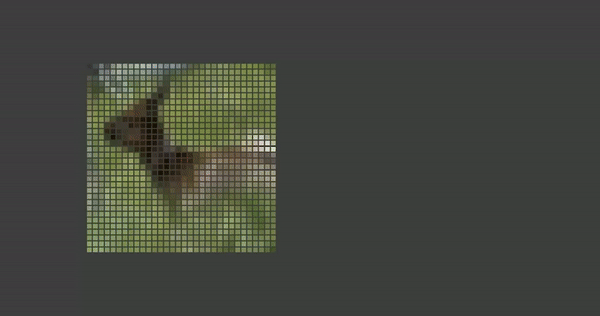

 Remove information by add noise rather than completely remove pixels.*

> <https://www.youtube.com/watch?v=zc5NTeJbk-k>

    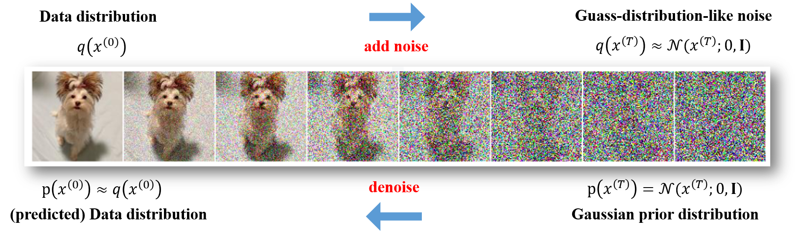
    An illustration of foreward/backward process for denoising diffusion models <a href="https://openreview.net/forum?id=PxTIG12RRHS&utm_campaign=NLP%20News&utm_medium=email&utm_source=Revue%20newsletter">[6]</a>.
    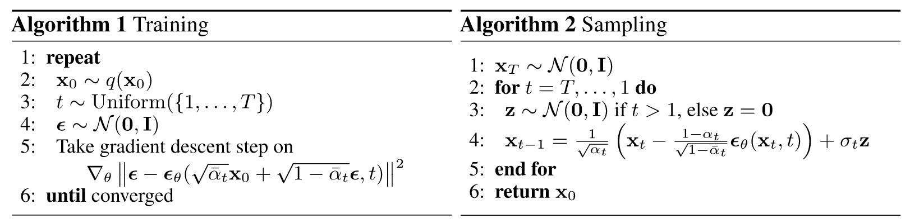
Algorithm of denoising diffusion probabilistic models (DDPM) <a href="https://proceedings.neurips.cc/paper/2020/hash/4c5bcfec8584af0d967f1ab10179ca4b-Abstract.html">[15]</a>.

## Techniques of Diffusion Models

### Evolution of Architectures

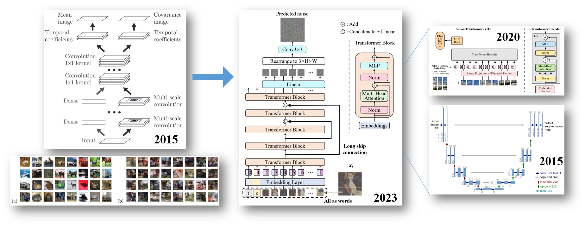
    
Left: Architecture of a CNN-based diffusion model <a href="https://proceedings.mlr.press/v37/sohl-dickstein15.html">[7]</a> with training dataset (a) and generation samples (b).

    
Center: Architecture of U-ViT <a href="https://openaccess.thecvf.com/content/CVPR2023/html/Bao_All_Are_Worth_Words_A_ViT_Backbone_for_Diffusion_Models_CVPR_2023_paper.html">[8]</a>.

    
Right: Fundemantal archicture of U-ViT. above: ViT <a href="https://openreview.net/forum?id=YicbFdNTTy">[9]</a>; below: U-Net <a href="http://link.springer.com/10.1007/978-3-319-24574-4_28">[10]</a>. 

### Conditional Generation

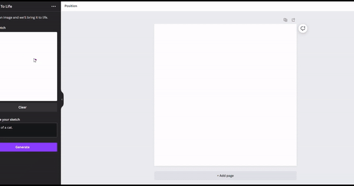

    Conditional image generation with sketch.*
    

> [https](https://www.youtube.com/watch?v=zc5NTeJbk-k)[://](https://www.youtube.com/watch?v=zc5NTeJbk-k)[www.youtube.com/watch?v=zc5NTeJbk-k](https://www.youtube.com/watch?v=zc5NTeJbk-k)
>
> <https://www.canva.com/>

### Robustness

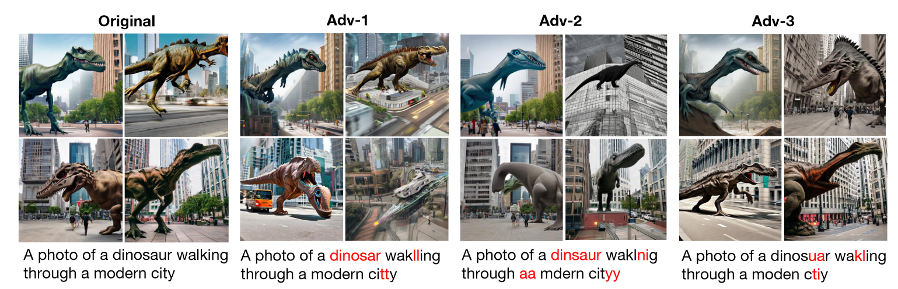
 An illustration of human attack against Stable Diffusion*. Adversarially modified content is highlighted in red <a href="http://arxiv.org/abs/2306.13103">[11]</a>.

> <https://stability.ai/news/stable-diffusion-3>

## Practice on Diffusion Model

### Diffusion Model in Remote Sensing

 MetaEarth <a href="http://arxiv.org/abs/2405.13570">[12]</a>: A generative foundation model for global-scale remote sensing image generation. Remote sensing image generation samples. 
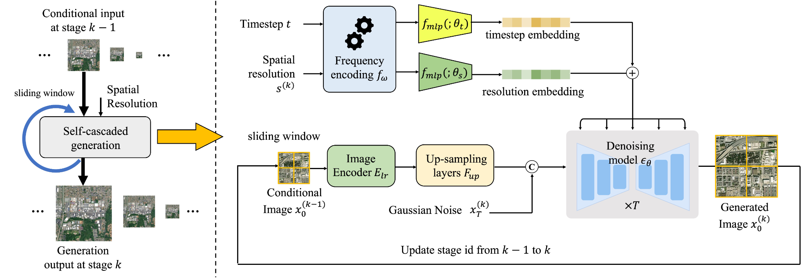
Overview of MetaEarth architecture <a href="http://arxiv.org/abs/2405.13570">[12]</a>.

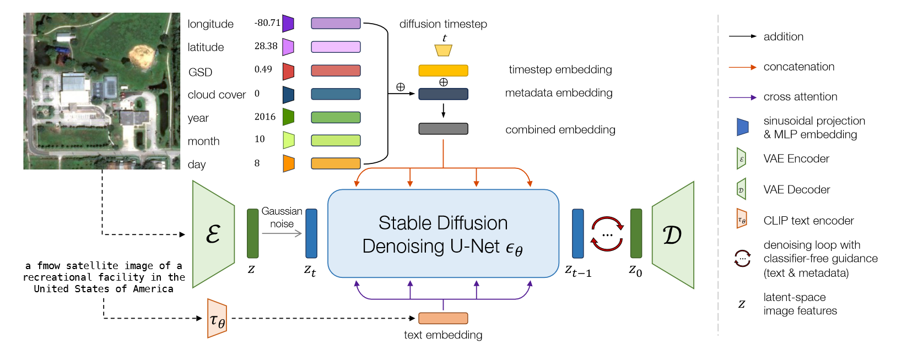
 Conditioning on freely available metadata and using large, publicly available satellite imagery datasets shows DiffusionSat <a href="http://arxiv.org/abs/2312.03606">[13]</a> is a powerful generative foundation model for remote sensing data. Left: Overview of architecture. 
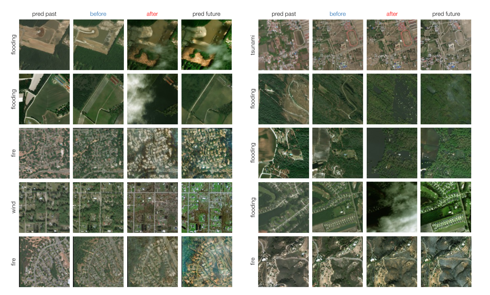
Onpainting results <a href="http://arxiv.org/abs/2312.03606">[13]</a>.

### Research Background

    

        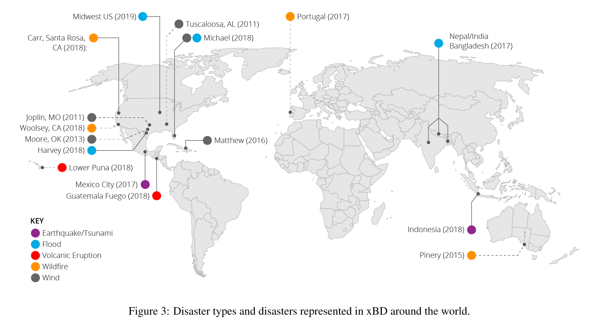
        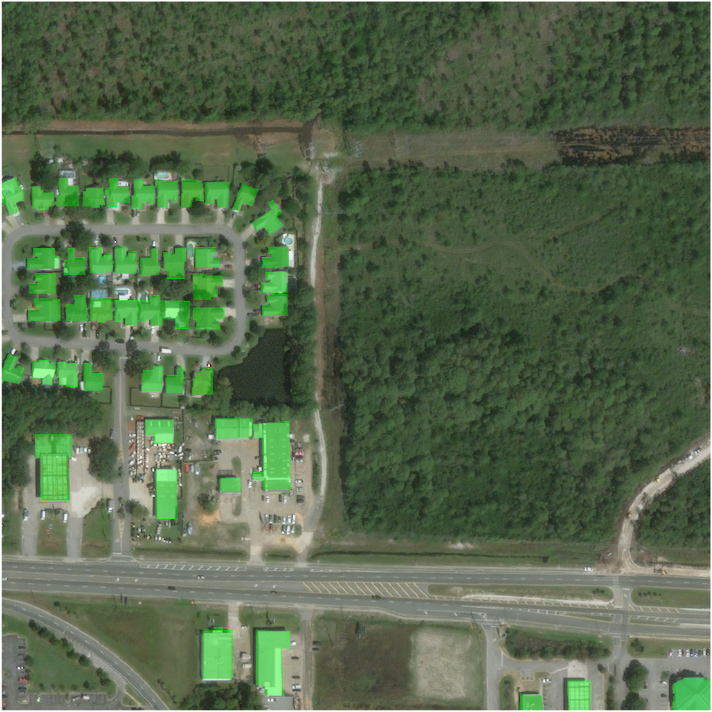
    

    
 Left: Disaster types and disasters represented in xBD <a href="http://arxiv.org/abs/1911.09296">[14]</a> around the world.
Right: Building polygons (shown in green) on imagery from Hurricane Michael (2018).

**Abstract**: [Background] Object Detection of Damaged Buildings in disastrous event is important for aiding and reconstruction. [Problem] Current approaches for building damage assessment include CNN-based models and Transformer-based models. However, these pre-trained model is still lack of general capability which fails to timeliness of detection in terms of disastrous events. [Method] In this work, we propose a generative model *ModelName* to manufacture potential post-disaster images from vulnerable regions at global scale, be it Global Building Damage (GBD) dataset. [Result] We find that after further training SOTA models on GBD, the performance of models show great improvements.

   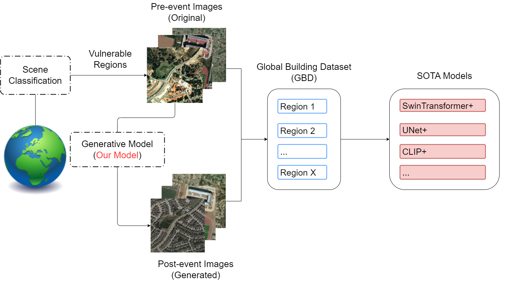
    
 Overview of our GBD framework.

### Experiments

Course Objectives:

\1. Learn to use Github for team collaboration

\2. Acquire the ability to configure a deep learning environment on a server

\3. Gain the capability to deploy and run deep learning models (diffusion models) on a server

\4. Understand the basic principles of diffusion models

\5. Become familiar with common remote sensing datasets/data sources

\6. Use the DiffusionSAT model to generate disaster remote sensing images

\7. Attempt to build or run condition-constrained diffusion models to generate pre- and post-disaster remote sensing image pairs

课程目标：

\1. 学会使用Github进行团队协作

\2. 具备配置服务器深度学习环境的能力

\3. 具备在服务器上部署并运行深度学习模型（扩散模型）的能力

\4. 了解扩散模型的基本原理

\5. 熟悉常用遥感数据集/数据源

\6. 使用DiffusionSAT模型生成灾害遥感影像

\7. 尝试构建或运行具有条件约束的扩散模型以生成灾害前后遥感影像对

## References

[1] Z. Deng, "扩散模型: 方法与应用" [Advanced Neural Networks, Spring, 2024], Qing Yuan Research Institute, Shanghai Jiao Tong University, 2024.

[2] K. Simonyan and A. Zisserman, ‘Very Deep Convolutional Networks for Large-Scale Image Recognition’, in International Conference on Learning Representations, 2014.

[3] W. Yu, K. Yang, T. Xiao, H. Yao, and Y. Rui, ‘Visualizing and Comparing AlexNet and VGG using Deconvolutional Layers’, 2016.

[4] O. Russakovsky et al., ‘ImageNet Large Scale Visual Recognition Challenge’. arXiv, Jan. 29, 2015.

[5] A. van den Oord, N. Kalchbrenner, and K. Kavukcuoglu, ‘Pixel Recurrent Neural Networks’, in Proceedings of The 33rd International Conference on Machine Learning, PMLR, Jun. 2016, pp. 1747–1756.

[6] Y. Song, J. Sohl-Dickstein, D. P. Kingma, A. Kumar, S. Ermon, and B. Poole, ‘Score-Based Generative Modeling through Stochastic Differential Equations’, presented at the International Conference on Learning Representations, Oct. 2020.

[7] J. Sohl-Dickstein, E. Weiss, N. Maheswaranathan, and S. Ganguli, ‘Deep Unsupervised Learning using Nonequilibrium Thermodynamics’, in Proceedings of the 32nd International Conference on Machine Learning, PMLR, Jun. 2015, pp. 2256–2265.

[8] F. Bao et al., ‘All Are Worth Words: A ViT Backbone for Diffusion Models’, presented at the Proceedings of the IEEE/CVF Conference on Computer Vision and Pattern Recognition, 2023, pp. 22669–22679.

[9] A. Dosovitskiy et al., ‘An Image is Worth 16x16 Words: Transformers for Image Recognition at Scale’, in International Conference on Learning Representations, Oct. 2020.

[10] O. Ronneberger, P. Fischer, and T. Brox, ‘U-Net: Convolutional Networks for Biomedical Image Segmentation’, in International Conference on Medical Image Computing and Computer-Assisted Intervention, N. Navab, J. Hornegger, W. M. Wells, and A. F. Frangi, Eds., Cham: Springer International Publishing, 2015, pp. 234–241.

[11] H. Gao, H. Zhang, Y. Dong, and Z. Deng, ‘Evaluating the Robustness of Text-to-image Diffusion Models against Real-world Attacks’. arXiv, Jun. 15, 2023.

[12] Z. Yu, C. Liu, L. Liu, Z. Shi, and Z. Zou, ‘MetaEarth: A Generative Foundation Model for Global-Scale Remote Sensing Image Generation’. arXiv. May 28, 2024.

[13] S. Khanna et al., ‘DiffusionSat: A Generative Foundation Model for Satellite Imagery’, in International Conference on Learning Representations (ICLR 2024), Dec. 2023.

[14] R. Gupta et al., ‘xBD: A Dataset for Assessing Building Damage from Satellite Imagery’. arXiv, Nov. 21, 2019.

[15] J. Ho, A. Jain, and P. Abbeel, ‘Denoising Diffusion Probabilistic Models’, in Advances in Neural Information Processing Systems, Curran Associates, Inc., 2020, pp. 6840–6851.
