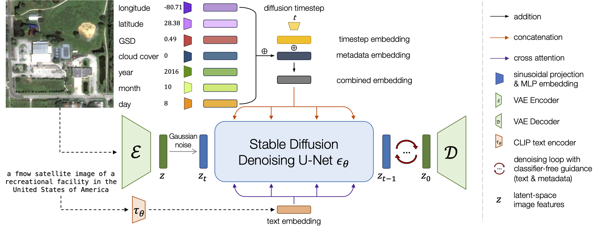

# Pipeline of Short-Term Course Project: Post-event Remote Sensing Image Generation based on Conditional Diffusion Model

## Overview

- Develop a Conditional Diffusion Model specialized for post-event remote sensing image generation
- Compare our model with mainstream model to show the strength (e.g. [FID](https://proceedings.neurips.cc/paper/2017/hash/8a1d694707eb0fefe65871369074926d-Abstract.html), downstream task augmentation, less hallucination) of our model
- Produce a synthetic dataset based our model  

<details>
<summary>Future Work</summary>
1. ControlNet++: Improving Conditional Controls with Efficient Consistency Feedback
   <a href="https://github.com/liming-ai/ControlNet_Plus_Plus">Code</a>,
   <a href="https://liming-ai.github.io/ControlNet_Plus_Plus/">Paper</a> (Accepted by ECCV 2024)<div></div>
2. Uni-ControlNet: All-in-One Control to Text-to-Image Diffusion Models
   <a href="https://github.com/ShihaoZhaoZSH/Uni-ControlNet">Code</a>,
   <a href="https://proceedings.neurips.cc/paper_files/paper/2023/hash/2468f84a13ff8bb6767a67518fb596eb-Abstract-Conference.html">Paper</a> (Accepted by NeurIPS 2023)
   <div></div>
3. OpenEarthMap: A Benchmark Dataset for Global High-Resolution Land Cover Mapping
   <a href="https://open-earth-map.org/">Dataset</a>,
   <a href="https://openaccess.thecvf.com/content/WACV2023/html/Xia_OpenEarthMap_A_Benchmark_Dataset_for_Global_High-Resolution_Land_Cover_Mapping_WACV_2023_paper.html">Paper</a> (Accepted by WACV 2023)
   <div></div>
</details>

## Experiment Pipeline

1. Generate (pre/post-event) Remote Sensing Images with [Stable Diffusion](https://github.com/CompVis/stable-diffusion) (prompt only)

2. Generate (pre/post-event)  Remote Sensing Images with [DiffusionSAT](https://github.com/samar-khanna/DiffusionSat) (no conditioning version)

   - prompt only
   - prompt & reference image (i.e. pre-event image)

   > Compared with step1, DiffusionSAT generates better post-event remote sensing images (RSIs).

3. Generate (pre/post-event) Remote Sensing Images with [DiffusionSAT](https://github.com/samar-khanna/DiffusionSat) (conditioning version)

   - prompt only
   - prompt & reference image
   - prompt & reference image & segmentation map

   > Compared with step2, DiffusionSAT with conditioning fine-tuning (i.e. [ControlNet](https://github.com/lllyasviel/ControlNet)) generates better post-event RSIs.

4. Further Fine-tuning DiffusionSAT, focus on the post-event RSIs Generation Capabilty

   - [xBD](https://xview2.org/dataset) (satellite: WorldView/QuickBird, resolution: ~0.5m)
   - `Vivid Standard Imagery Basemaps` samples from [Maxar](https://resources.maxar.com/product-samples/vivid-standard-imagery-basemaps-global-locations) (satellite: WorldView/QuickBird,  resolution: ~0.5m)
   - ... (ref to [heating dataset](../paper_writing/paper.md#dataset))

## Experiments

### Main

| Models                      | FID  | CLIP-Score | SSIM | PSNR |
| --------------------------- | ---- | ---------- | ---- | ---- |
| Stable Diffusion ( sd v2.1) |      |            |      |      |
| Stable Diffusion XL Turbo   |      |            |      |      |
| Stable Diffusion 3          |      |            |      |      |
| ControlNet v1.1 (sd v2.1)   |      |            |      |      |
| DiffusionSAT-base (sd v2.1) |      |            |      |      |
| **Our Model**               |      |            |      |      |

<div align="center">Table. Comparison of Post-event Image Generation with <a href="https://github.com/CompVis/stable-diffusion">Stable Diffusion</a> based models.</div>

> DiffusionSAT (base)  denotes checkpoint of single generation model.

### Ablation

#### Prompt Style

- **Normal**: a fmow satellite image of a amusement park in Australia
- **Weighted**: fmow, (satellite image:2) , amusement park, Australia
- **Adversial**: a fmow sattellitte image of a amusement park in Australia
- ...

<div align="center">Figure. Comparison of Post-event Image Generation with different prompt style.</div>

#### Hyper Parameters

- Steps
- Image Size
- ...

### Safety Check

> Generated Images can be unsafe (releted to millitary et al.).

DiffusionSAT is able to check image safety.

## Dataset Preparation

> using language model (gpt-3.5.-turbo) to generate batch prompt (.json)

### Desired Format

```json
[
    {
       "key":"value",
        ...
    },
    {
}
]
```

### Hierarchy/Loop/Combination Generation Pipeline

2000 prompts = 50 cities&metadata × 4 disasters  × 10 captions

## Training ControlNet for DiffusionSat

> ref: [Tutorial](https://huggingface.co/blog/train-your-controlnet)

- Task: Training a controlnet component into DiffusionSat (e.g. `finetune_sd21_sn-satlas-fmow_snr5_md7norm_bs64.checkpoint`)

- Goal: The result model is able to generate pre-event/post-event satellite image with refered image as well as prompt (e.g. flooding,hurricane,wildfire) This is regarded as an inpainting image-to-image task. (see [Huggingface Inpainting](https://huggingface.co/docs/diffusers/v0.29.2/en/using-diffusers/sdxl#image-to-image))

- Dataset Source: xBD (~10000 image pairs,512×512), SpaceNet8 (~1300 image pairs, ranging size over 512×512)

- Curated Training Dataset Format Sample (see [Huggingface Image Dataset](https://huggingface.co/docs/datasets/image_dataset#imagefolder))

  - Dataset Structure

      ```bash
      controlnet_dataset/
      │
      ├── train/                      # Training dataset
      │   ├── images/                 # Target images (ground_truth)
      │   │   ├── image1_pre.png
      │   │   ├── image2_post.png
      │   │   └── ...
      │   ├── captions.json           # Text prompts as well as metadata for each image
      	├── mask/                   # （opt）Mask images (e.g. region that affected by disaster)
      │   │   ├── image1_mask.png
      │   │   ├── image2_mask.png
      │   │   └── ...
      │   └── conditioning_images/    # pre-event/post-event image paired with target image
      │       ├── image1_post.png
      │       ├── image2_pre.png
      │       └── ...
      │
      ├── val/                        # Validation dataset (structured similarly to train/)
      │   └── ...
      │
      └── test/                       # Test dataset (structured similarly to train/)
          └── ...
      
      ```
  
  - `captions.json`
  
      ```json
      {
          [
          "prompt":...,
          "metadata":...,
          "ground_truth_image":...,
          "conditioning_image":...
          ],
      }
      ```
  
      

### Supplementary Details from DiffusionSat




| Dataset       | Caption                                                      |
| ------------- | ------------------------------------------------------------ |
| fMoW          | "a [fmow] satellite image [of a <object>] [in <country>]"    |
| SpaceNet      | "a [spacenet] satellite image [of <object>] [in <city>]"     |
| Satlas        | "a [satlas] satellite image [of <object>]"                   |
| Texas Housing | "a [satlas] satellite image [of houses] [built in <year_built>] [covering <num_acres> acres]" |
| xBD           | "a [fmow] satellite image [<before/after>] being affected by a <disaster_type> natural disaster" |

