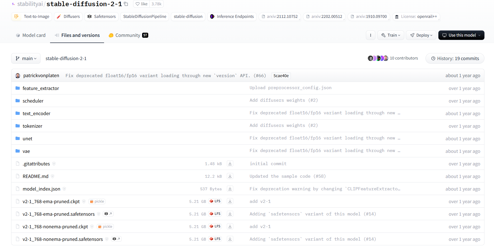

# Deploy Stable Diffusion from Scratch with Diffusers

> Author: Sakura
>
> Last Updated:14 June,2024

## Outline

- Quick Start

  - Setup a simple project

  - Download model weights

  - Setup environment

  - Generate your first image with diffusers' pipeline

- Fine-tuning your own Stable Diffusion Model

  - Prepare training dataset
  - Further training
    - LORA
  - ControlNet

- Common Q&A

  - The model file structure and how they work
  - What's difference between model weights format (e.g. *.safetensors,*.bin, *.ckpt)

## Quick Start

### Setup a simple project

As we are using [diffusers](https://hf-mirror.com/docs/diffusers/v0.29.2/en) package for stable diffusion based model deployment, there is **little** code required a simple text-to-image/image-to-image generation project. Just create a project in the most simpliest way as below.

```bash
SD-Difusers-all-in-one/
├── data/
├── src/
├── main.py
├── .gitignore
├── README.md
└──requirements.txt
```

### Download model weights

These heating models/projects always have a huggingface repo contains all you need. Here, we take [Stable Diffusion v2.1](https://hf-mirror.com/stabilityai/stable-diffusion-2-1) as an example.

> As [huggingface.co](https://huggingface.co/) often encounters network error, we highly recommend to use mirror webpage namely [hf-mirror](https://hf-mirror.com/).

1. Look for the Official Repo for [Stable Diffusion v2.1](https://hf-mirror.com/stabilityai/stable-diffusion-2-1)


2. Go for `Files and versions`



You can get these files in 3 ways.

A. Install `diffusers` python package and downloading model file with well-organized structure into your project as follows:

```python
from diffusers import DiffusionPipeline

pipeline = DiffusionPipeline.from_pretrained("stabilityai/stable-diffusion-2-1")
```

> [!NOTE]
> Before doing this, you need have access to huggingface token, set it through huggingface-cli and check connection to [huggingface.co](https://huggingface.co/), because `from_pretrained` function would pull the model from  [huggingface.co](https://huggingface.co/) with corresponding model hub page.

B. Clone this repo using git clone as well as **git-lfs** (git for large files)

```bash
# Make sure you have git-lfs installed (https://git-lfs.com)
git lfs install
git clone https://hf-mirror.com/stabilityai/stable-diffusion-2-1
# If you want to clone without large files - just their pointers
GIT_LFS_SKIP_SMUDGE=1 git clone https://hf-mirror.com/stabilityai/stable-diffusion-2-1
```

> Still, you need have access to huggingface token.

C. Manually download by multi-click (the way the author use)

As there would not be too many files for downloading, manually downloading files is okay.

> [!CAUTION]
> You should manually correct the file name when downloading file from a subfolder in root directory. For instance, a file named `scheduler_config.json` under `scheduler` folder would turn to `scheduler_scheduler_config.json` (being added folder name with '_').
>
> ```bash
> root/ #huggingface hub 
> ├── scheduler/
>  └──scheduler_config.json
> ```
>
> ```bash
> SD-Difusers-all-in-one/ #your project 
> ├── models/
> |   └──scheduler/
> |  └──scheduler_scheduler_config.json # should be correct into scheduler_config.json
> ├── data/
> ├── src/
> ├── main.py
> ├── .gitignore
> ├── README.md
> └──requirements.txt
> 
> ```

### Setup environment

For quick start, only a few packages is required (but can be large). If you want to deploy with GUI, you can refer to the requirements.txt in correspondent  GitHub Repo.

````python
# requirements.txt

## common packages

## Required Package:
diffusers
transformers
pytorch
accelerate
xformers
# should be more ...

## Optional Packages:
streamlit # GUI
gradio # GUI
matplotlib 
tqdm
# ....
````

Using Python Virtual Env:

```bash
cd SD-Difusers-all-in-one # go to the root directory
python -m venv .venv # virual env named .venv which could be instantly ignored by .gitignore
.\.venv\Scripts\activate # windows
# 'source .venv/bin/activate' on macOS and Linux
pip install -r requirements.txt
```

Using Conda Env

```
cd SD-Difusers-all-in-one # go to the root directory
conda create --name sd-all python=3.10
conda activate sd-all
conda install cudatollkit pytorch torchvision
pip install -r requirements.txt
```

> [!CAUTION]
>
> The `diffusers` package is updating fast. Therefore, we always manually download source code from <https://github.com/huggingface/diffusers>, and place it under `/src` or `/lib` in root directory. Given this, we would import the `diffusers` package as follow:
>
> ```bash
> from lib.diffusers import StableDiffusionPipeline, DPMSolverMultistepScheduler
> # instead of 'from diffusers import ...' which import the module from conda env
> ```

#### Setup conda env from Windows to Linux

1. Install Ubuntu on Windows

 The following commands are executed in Ubuntu.

1. Create conda env named `sd-all`

    ```bash
    conda create -n sd-all python=3.10
    ```

2. Install more packages

    ```bash
    conda install pytorch 
    conda install torchvision
    conda install torchaudio pytorch-cuda=12.1 -c pytorch -c nvidia
    pip install transformers accelerate safetensors ipykernel tensorboard
    pip install open_clip_torch
    conda install -c conda-forge diffusers
    conda install xformers -c xformers
    conda install -c huggingface -c conda-forge datasets
    ```

3. Install conda-pack to wrap up conda env from Windows to Linux

    ```bash
    conda install -c conda-forge conda-pack
    ```

4. After successfully installing all the necessary packages, pack it up

    ```bash
    conda pack -n sd-all -o sd-all.tar.gz
    ```

6. Move env package from Ubuntu to PC

    ```bash
    mv sd-all.tar.gz /mnt/d # move to Drive D:
    ```

7. Upload env onto Linux server and unpack it

   ```bash
   mkdir -p /home/gis2024/.conda/envs/sd-all # create a empty folder named sd-all in conda envs directory
   tar -xzf sd-all.tar.gz -C /home/gis2024/.conda/envs/sd-all #unpack env
   /home/gis2024/.conda/envs/sd-all/bin/conda-unpack
   ```

[Working with TIFF files (kaggle.com)](https://www.kaggle.com/code/yassinealouini/working-with-tiff-files)
