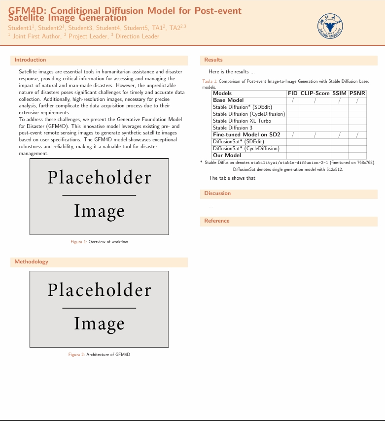

# GFM4D: Conditional Diffusion Model for Post-event Satellite Image Generation

> Overleaf Project: [Link](https://www.overleaf.com/project/667922a3a7c41ed63125f4c1)
>
> Contribution Sample:
>
> **Authors:** Student1 (Stu1), Student2 (Stu1), Student3 (Stu), Student4 (Stu), Student5 (Stu), TA1 (TA2), TA2 (TA3)
>
> 1 Joint First Author, 2 Project Leader, 3 Direction Leader
>
> **Abstract**: ...

Poster Demo

## Outline

Outline

<h3>Background</h3>
<ul>
<li>info1</li>
<li>info2</li>
</ul>
<h3>Section2</h3>
    <ul>
<li>...</li>
</ul>

